# Skynet SLG 第一课实操：从 H5 登录到进入世界

第一课在 WSL 的空目录中写出两条接入同一业务链路的协议：Chrome H5 / Node E2E 可以连接 Protobuf 端口，也可以连接固定 Header + 自定义二进制 Body 端口。两条链路都进入同一个 Login、PlayerAgent、WorldMgr 和 RegionWorker。课程资料留在 Windows G 盘，实际工程固定放在 Linux Home：

```text
课程资料：G:\simbi\dev\skynet-slg-learning
实际工程：~/workspace/skynet-slg-server
```

本课不会重装 WSL 或 Ubuntu。Windows 和 Windows 版 VS Code 已经存在；你会亲自检查并恢复其余工具、创建全部文件、编译、运行、测试和调试。

完成后的真实请求路径是：

```text
Chrome H5 / Node E2E
  -> ws://127.0.0.1:8890/game: Protobuf Envelope + Protobuf Body
  -> ws://127.0.0.1:8891/game: 8-byte Header + 自定义二进制 Body
  -> 两个 WebSocket Listener / ConnectionWorker 的对应协议模块
  -> 相同的内部 Request Table
  -> Auth / PlayerMgr / PlayerAgent
  -> Memory Storage
  -> WorldMgr
  -> RegionWorker
  -> ensure_player_city / query_rect
  -> 按原连接的协议编码 Response
  -> WebSocket Binary Message
```

我们要做的是一个共享大地图的城建、行军、争地类 SLG Server。玩家有自己的主城和资源，主城占世界地图上的一个格子；后续玩家可以派出部队行军，在地图上争夺位置，与联盟成员协作。课程逐课扩展同一个工程，并不要求第一课就做出完整游戏。

第一课先在 H5 输入玩家 ID 和开发用 Token，点击“连接并登录”，收到基础玩家快照；此时还没有主城。随后加入 EnterWorld：Server 为首次进入的玩家在 256 × 256 地图上分配一个不与别人冲突的主城格子，并返回玩家、主城和世界参数。最后加入矩形 QueryWorld，查看范围内的主城对象。当前 H5 用文字日志展示返回数据，还没有可拖动的地图画面。再次进入世界应拿到原来的主城，另一名玩家不能占据同一格。这里的资源只是玩家快照字段，第一课尚无采集或建造玩法。

第一课只实现 City World Marker。Army、March、Viewport Subscription、Battle、Alliance 和 MySQL 不在本课代码中提前出现。

## 1. 本课要完成的行为与三个终端

本课最后会形成下面这些可观察的行为。它们是后文代码的方向，不是每节都要提交材料的验收清单：

- Skynet 固定为 v1.8.0，Lua 为 bundled modified Lua 5.4.7；
- Chrome 页面能够 Login、EnterWorld、QueryWorld；
- Chrome DevTools 能分别看到两个端口的 Binary Message，并对应 Version、Command、Sequence；
- 错误 Token 返回 `AUTH_FAILED`；
- 同一玩家重复 EnterWorld 返回同一个 City；
- 两名玩家不会占用同一个 Grid；
- 16 个 Logical Region 只由 4 个 RegionWorker Service 持有；
- Node E2E 分别连接两个真实 WebSocket 端口，验证相同业务结果；
- `./scripts/linux/test.sh` 输出 `ALL_TESTS_OK`；
- LuaPanda 能命中 ConnectionWorker、PlayerAgent 和 RegionWorker；
- Debug Console 能查看动态 Service；
- GDB 能停在 `main`、`skynet_start`、`skynet_context_new` 和 `snlua_create`。

本文固定使用下面的终端名称：

| 名称 | 打开位置 | 典型提示符 | 用途 |
|---|---|---|---|
| 终端 A | Windows Terminal 的 PowerShell | `PS C:\Users\...>` | 检查 WSL 和磁盘 |
| 终端 B | Windows Terminal 的 Ubuntu | `simbi@host:~$` | 创建工程并首次执行 `code .` |
| 终端 C | VS Code 底部的 WSL 集成终端 | `simbi@host:~/workspace/skynet-slg-server$` | 后续全部 Linux 命令 |

终端 B 和 C 使用同一个 Ubuntu。若 VS Code Terminal 显示 `PS C:\...>`，它是 Windows PowerShell，不能执行本文的 Bash 命令。

## 2. 检查现有 WSL，不做破坏性重装

在**终端 A：Windows PowerShell**执行：

```powershell
wsl --status
wsl --list --verbose
```

Ubuntu 应显示 Version 2。然后进入 Ubuntu：

```powershell
wsl -d Ubuntu
```

如果实际 Distribution 名称是 `Ubuntu-24.04`，使用现场显示的名称。本文不执行 `wsl --unregister`，也不移动现有 VHDX。

在打开的**终端 B：Ubuntu Shell**执行：

```bash
whoami
pwd
uname -a
df -h ~
```

`pwd` 此时通常是 `/home/<用户名>`。如果是 `/mnt/c/Users/...`，先执行：

```bash
cd ~
```

工程必须放在 Linux Home，不放在 `/mnt/c` 或 `/mnt/g`。WSL 的 Linux 文件系统对大量小文件、Make 和 Git 的行为更接近生产 Linux。

安装本课工具。在**终端 B**执行：

```bash
sudo apt update
sudo apt install -y \
    build-essential \
    autoconf \
    git \
    gdb \
    curl \
    ca-certificates \
    file \
    netcat-openbsd \
    python3 \
    nodejs \
    npm
```

逐项确认：

```bash
gcc --version
make --version
git --version
gdb --version
node --version
npm --version
python3 --version
```

这些命令只读取版本。若 APT 报错，不要跳过；网络、Source 或 Package 状态没有恢复前，后续构建结果不可复现。WSL 可能通过 Windows PATH 找到 `/mnt/c/Program Files/nodejs/npm`，即使 Ubuntu 本身没有安装 `node`。这时 `npm --version` 能输出数字，不代表 Linux Node 环境可用。在**终端 B**继续检查：

```bash
command -v node
command -v npm
node -p 'process.platform'
```

两条路径必须位于 WSL Linux 文件系统，`process.platform` 必须输出 `linux`。若 `node` 不存在，或 `npm` 路径以 `/mnt/` 开头，先在**终端 B**执行 `sudo apt update && sudo apt install -y nodejs npm`。如果在同一个 Bash Terminal 里安装，随后执行 `hash -r` 清除 Bash 之前缓存的 Windows npm 路径，再运行 `type npm`、`npm --version` 和上述平台检查。`type npm` 应指向 `/usr/bin/npm` 或另一条 Linux 路径。不要在 Linux 工程中调用 Windows 的 npm 来生成 `node_modules` 或 Lock File；如果此前误运行过，先查看生成了哪些文件，再决定是否清理，不能直接覆盖已有 Lock File。

## 3. 从空目录创建工程并初始化 Git

仍在**终端 B**执行：

```bash
mkdir -p ~/workspace/skynet-slg-server
cd ~/workspace/skynet-slg-server
pwd
ls -la
```

`pwd` 必须类似：

```text
/home/simbi/workspace/skynet-slg-server
```

初始化本地 Git Repository：

```bash
git init -b main
git config --local user.name "你的名字"
git config --local user.email "你的邮箱"
git status -sb
```

`git init -b main` 在当前目录创建 `.git`，相当于让这个空目录成为一个本地版本库。SVN 的 Working Copy 在 Checkout 时绑定 Server URL；Git 可以先建立完整的本地 Repository，远程地址以后再加。

`git config --local` 只修改当前 Repository，不影响机器上的其他项目。`git status -sb` 是 `--short --branch`，当前应显示：

```text
## No commits yet on main
```

创建第一批目录：

```bash
mkdir -p \
    client/h5 \
    config \
    docs \
    lualib/common \
    lualib/protocol \
    lualib/world \
    protocol \
    scripts/linux \
    service/auth \
    service/gateway \
    service/player \
    service/storage \
    service/world \
    tests/integration \
    tests/protocol \
    tests/unit \
    third_party
```

在**终端 B**执行：

```bash
code .
```

Windows VS Code 会打开当前 WSL 目录。左下角必须显示 `WSL: Ubuntu`，Explorer 根目录应是 `skynet-slg-server`。此后统一使用**终端 C：VS Code WSL 集成终端**。

首次出现的 Git 图形操作也在这里完成：按 `Ctrl+Shift+G` 打开“源代码管理”。“更改”对应尚未 `git add` 的内容，“暂存的更改”对应下一次 Commit 将包含的内容。点击文件可使用左右 Diff；大型 Diff 不要求在终端里阅读。

## 4. 建立忽略规则和工程说明

在 VS Code Explorer 新建 `.gitignore`。

完整仓库路径：`.gitignore`

```gitignore
# 第三方源码和本机构建产物由 Bootstrap Script 恢复，不提交。
third_party/skynet/
third_party/lua-protobuf/
third_party/lua-protobuf-runtime/
third_party/luapanda/
third_party/luapanda-runtime/

# H5 Dependency 由 package-lock.json 恢复。
client/h5/node_modules/

# Proto Descriptor 由构建脚本从 game.proto 生成，不手工编辑。
protocol/game.pb
protocol/game.pb.tmp

# Runtime 日志和 Core Dump 不进入 Repository。
logs/
core
core.*

# Editor/OS 临时文件。
.DS_Store
*.swp
```

新建 `README.md`。

完整仓库路径：`README.md`

````markdown
# Skynet SLG Server

第一阶段提供：

- H5 WebSocket Client；
- Protobuf Envelope + Protobuf Body，以及 8-byte Custom Header + 自定义二进制 Body；
- Login / PlayerAgent / Memory Storage；
- WorldMgr / 16 Logical Region / 4 RegionWorker；
- 幂等首城创建和矩形世界查询；
- Unit Test、真实 WebSocket E2E 和调试入口。

统一验证：

```bash
./scripts/linux/test.sh
```
````

## 5. 固定并构建 Skynet v1.8.0

新建 `scripts/bootstrap_skynet.sh`。

完整仓库路径：`scripts/bootstrap_skynet.sh`

```bash
#!/usr/bin/env bash

# 打开 Bash 严格模式：
# -e：普通命令返回非 0 时停止脚本；
# -u：读取未定义变量时报错；
# -o pipefail：管道中任意命令失败，整条管道都算失败。
set -euo pipefail

# $0 是当前脚本的启动路径。
# dirname "$0" 取得 scripts/；再进入上一级就是仓库根目录。
# 双引号避免路径中有空格时被 Bash 拆成多个参数。
cd "$(dirname "$0")/.."

VERSION="v1.8.0"
DEST="third_party/skynet"

if [[ -f "$DEST/Makefile" ]]; then
    actual="$(git -C "$DEST" describe --tags --exact-match 2>/dev/null || true)"
    if [[ "$actual" != "$VERSION" ]]; then
        echo "Skynet version mismatch: expected=$VERSION actual=${actual:-unknown}" >&2
        exit 1
    fi
    echo "SKYNET_BOOTSTRAP_OK version=$actual"
    exit 0
fi

# 目录存在但不是完整源码时保留现场，不自动删除用户文件。
if [[ -e "$DEST" ]]; then
    echo "$DEST exists but is incomplete; inspect it manually" >&2
    exit 1
fi

git clone --recursive --branch "$VERSION" --depth 1 \
    https://github.com/cloudwu/skynet.git "$DEST"
git -C "$DEST" submodule update --init --recursive

echo "SKYNET_BOOTSTRAP_OK version=$VERSION"
```

新建 `scripts/linux/build.sh`。

完整仓库路径：`scripts/linux/build.sh`

```bash
#!/usr/bin/env bash

# 本脚本可以独立运行，因此再次声明严格模式和仓库根目录。
set -euo pipefail
cd "$(dirname "$0")/../.."

if [[ ! -f third_party/skynet/Makefile ]]; then
    ./scripts/bootstrap_skynet.sh
fi

# 使用 Skynet 官方 Linux Target 构建 Runtime、Bundled Lua、C Service
# 和 Lua C Module，不使用非官方 Windows Fork。
make -C third_party/skynet linux

echo "SKYNET_BUILD_OK"
```

赋予执行权限并运行：

```bash
chmod +x scripts/bootstrap_skynet.sh scripts/linux/build.sh
./scripts/bootstrap_skynet.sh
./scripts/linux/build.sh
```

检查关键产物：

```bash
git -C third_party/skynet describe --tags --exact-match
file third_party/skynet/skynet
file third_party/skynet/cservice/snlua.so
file third_party/skynet/luaclib/skynet.so
./third_party/skynet/3rd/lua/lua -v
```

预期 Tag 是 `v1.8.0`，Lua 显示 5.4.7。`skynet` 是 Process ELF；`snlua.so` 是 C Service；`luaclib/skynet.so` 让每个 Lua State 接入 Runtime。

## 6. 固定并构建 lua-protobuf

新建 `scripts/bootstrap_lua_protobuf.sh`。

完整仓库路径：`scripts/bootstrap_lua_protobuf.sh`

```bash
#!/usr/bin/env bash

set -euo pipefail
cd "$(dirname "$0")/.."

# 源码与编译产物分目录，升级或重建时不污染固定的上游 Commit。
SOURCE_DIR="third_party/lua-protobuf"
EXPECTED_COMMIT="ee4beb3865e2b82ea94b8a4314d78875c550ce20"

if [[ ! -d "$SOURCE_DIR/.git" ]]; then
    if [[ -e "$SOURCE_DIR" ]]; then
        echo "$SOURCE_DIR exists but is not a Git repository" >&2
        exit 1
    fi
    git clone --branch 0.5.3 --depth 1 \
        https://github.com/starwing/lua-protobuf.git \
        "$SOURCE_DIR"
fi

actual="$(git -C "$SOURCE_DIR" rev-parse HEAD)"
if [[ "$actual" != "$EXPECTED_COMMIT" ]]; then
    echo "lua-protobuf commit mismatch" >&2
    echo "expected=$EXPECTED_COMMIT" >&2
    echo "actual=$actual" >&2
    exit 1
fi

echo "LUA_PROTOBUF_SOURCE_OK commit=$actual"
```

新建 `scripts/linux/build_lua_protobuf.sh`。

完整仓库路径：`scripts/linux/build_lua_protobuf.sh`

```bash
#!/usr/bin/env bash

set -euo pipefail
cd "$(dirname "$0")/../.."

# 源码、项目私有运行产物、Skynet bundled Lua Header 各有明确来源。
SOURCE_DIR="third_party/lua-protobuf"
RUNTIME_DIR="third_party/lua-protobuf-runtime"
LUA_INCLUDE_DIR="third_party/skynet/3rd/lua"

if [[ ! -d "$SOURCE_DIR/.git" ]]; then
    ./scripts/bootstrap_lua_protobuf.sh
fi

test -f "$SOURCE_DIR/pb.c"
test -f "$SOURCE_DIR/protoc.lua"
test -f "$LUA_INCLUDE_DIR/lua.h"

mkdir -p "$RUNTIME_DIR/luaclib" "$RUNTIME_DIR/lualib"

# 使用 Skynet bundled Lua Header，保证 pb.so 与 snlua 内的 Lua ABI 一致。
# 不链接 Ubuntu System Lua；Module 加载时由当前 snlua 提供 Lua Symbol。
gcc -O2 -g -Wall -Wextra -shared -fPIC \
    -I "$LUA_INCLUDE_DIR" \
    "$SOURCE_DIR/pb.c" \
    -o "$RUNTIME_DIR/luaclib/pb.so"

# protoc 只供构建阶段把 game.proto 编译成 Descriptor；Service 不动态编译。
cp "$SOURCE_DIR/protoc.lua" "$RUNTIME_DIR/lualib/protoc.lua"

file "$RUNTIME_DIR/luaclib/pb.so"
echo "LUA_PROTOBUF_BUILD_OK"
```

执行：

```bash
chmod +x \
    scripts/bootstrap_lua_protobuf.sh \
    scripts/linux/build_lua_protobuf.sh
./scripts/bootstrap_lua_protobuf.sh
./scripts/linux/build_lua_protobuf.sh
```

不要把 `pb.so` 复制进官方 Skynet `luaclib`。项目自己的 Runtime 目录由配置显式加入 `lua_cpath`，升级和排错时不会污染上游源码。

## 7. 固定 H5 和 Node E2E 依赖

新建 `client/h5/package.json`。

完整仓库路径：`client/h5/package.json`

```json
{
  "name": "skynet-slg-h5-client",
  "private": true,
  "version": "1.0.0",
  "type": "module",
  "dependencies": {
    "protobufjs": "7.5.4",
    "ws": "8.18.3"
  }
}
```

在**终端 C**执行：

```bash
cd ~/workspace/skynet-slg-server/client/h5
hash -r
type npm
command -v node
command -v npm
node -p 'process.platform'
npm install
npm ls --depth=0
cd ../..
git status -sb
```

只有 `node`、`npm` 都来自 WSL Linux 路径且平台为 `linux` 时才执行 `npm install`。`npm ls --depth=0` 应显示 `protobufjs@7.5.4`、`ws@8.18.3`。`npm install` 生成 `package-lock.json`；检查 `client/h5/package-lock.json` 存在。Repository 提交 `package.json` 和 Lock File，不提交 `node_modules`。新 Clone 使用 `npm ci` 按 Lock File 恢复精确依赖。这里固定的是两项直接依赖和完整 Lock File，不能只凭 `package.json` 声称传递依赖也已固定。

做第一个 Git Checkpoint：

```bash
git add \
    .gitignore \
    README.md \
    client/h5/package.json \
    client/h5/package-lock.json \
    scripts/bootstrap_skynet.sh \
    scripts/bootstrap_lua_protobuf.sh \
    scripts/linux/build.sh \
    scripts/linux/build_lua_protobuf.sh
git status -sb
```

`git add` 把指定版本放入 Staging Area。它接近 SVN 提交前选择文件，但尚未发送到任何 Server，也没有形成 Commit。按 `Ctrl+Shift+G`，这些文件应位于“暂存的更改”；逐个点击即可使用图形 Diff 复查。

确认后执行：

```bash
git commit -m "chore: initialize slg toolchain"
```

`git commit` 把暂存内容写成本地 Commit。Git 将 SVN 的一次远程 Commit 拆成了本地 `commit` 和以后显式执行的 `push`；当前没有 Remote，所以不执行 Push。

## 8. 第一条业务是 Login：确认玩家身份并加载状态

客户端的第一条业务请求是 Login。玩家 `10001` 携带开发期 Token `dev:10001`；Server 验证身份，找到或创建这个玩家的基础 PlayerAgent，从 Memory Storage 加载玩家快照。错误 Token 返回 `AUTH_FAILED`。本节只写内部业务，紧接着第 11 节绑定连接并从 H5 收到 LoginResponse；此时不创建主城，也不需要知道主城坐标。

先把 Login 看成已经解析好的内部参数 `player_id` 和 `token`。Auth 负责验证 Token；PlayerMgr 负责同一玩家的 Agent 创建与发现；PlayerAgent 持有玩家运行态；Memory Storage 提供 Snapshot。业务不接收 WebSocket 字节或 Protobuf 对象。后面接入网络时，ConnectionWorker 负责逻辑连接绑定，并把业务结果编码回客户端。

接下来的实现顺序是 Memory Storage、Auth/PlayerMgr/PlayerAgent 的 Login 路径，随后立即接 WebSocket 和 H5 Login，再进入 EnterWorld 需要的坐标、RegionWorker 和 WorldMgr。Login 与 EnterWorld 是两条不同的业务请求：登录成功并不等于玩家已经有主城。两个端口始终调用同一套 Login 业务，后续世界业务也沿这条连接扩展。

## 9. 写 Memory Storage：Login 的玩家快照

Memory Storage 在第一课只模拟持久化接口。PlayerAgent 在线时是玩家运行态 Owner；MemoryWorker 持有保存用的 Snapshot。`skynet.call` 的参数和 `skynet.retpack` 的返回值都会经过 Skynet 消息序列化，发送方与接收方处于不同 Lua State，不共享同一个 Lua Table 引用。因此这里不再额外写一个 `deep_copy`。此前示例中的 `value` 是待复制的表，`seen` 是递归过程中记录“原表 → 新表”的内部映射；它们都不是 Login Request 字段。这个递归函数在当前调用链没有必要，还会多复制一次 Snapshot。

新建 `service/storage/memory_worker.lua`。

完整仓库路径：`service/storage/memory_worker.lua`

```lua
-- 仓库路径：service/storage/memory_worker.lua
-- 一个 Worker 只持有分配给自己的玩家 Snapshot。第一课进程退出后数据丢失；
-- 第二课接入 MySQL 和行军恢复时，PlayerAgent 的 load/save Contract 不变。
local skynet = require "skynet"

local CMD = {}
local worker_index
local players = {} -- 只保存本 Worker 分片的 Snapshot；Process 退出后丢失。

-- StorageMgr 创建本 Service 后传入 index（1-based Worker 编号）；
-- 只在启动时调用一次，防止重新 init 改写已持有状态的 Worker 身份。
function CMD.init(index)
    assert(not worker_index, "memory worker already initialized")
    worker_index = assert(math.tointeger(index))
    return true
end

-- StorageMgr 从 PlayerAgent 的 load 请求转来 player_id；没有记录时才创建默认 Snapshot。
-- 本函数只读写当前 MemoryWorker 的 players，不跨 Service，也不 yield。
function CMD.load_player(player_id)
    player_id = assert(math.tointeger(player_id), "invalid player_id")
    local snapshot = players[player_id]
    if not snapshot then
        snapshot = {
            player_id = player_id,
            name = "lord_" .. player_id,
            city_id = 0,
            wood = 1000,
            food = 1000,
        }
        players[player_id] = snapshot
    end

    -- skynet.retpack 会序列化返回值；Agent 收到的是自己的 Lua Table。
    return true, snapshot
end

-- save_player 的 player 来自 Agent 发出的 Skynet Message；反序列化后已是
-- MemoryWorker Lua State 中的独立 Table，可以直接作为本 Worker 的 Snapshot。
function CMD.save_player(player)
    assert(type(player) == "table", "player must be table")
    local player_id = assert(math.tointeger(player.player_id))
    players[player_id] = player
    return true
end

skynet.start(function()
    skynet.dispatch("lua", function(session, source, command, ...)
        local fn = assert(CMD[command],
            "unknown memory worker command: " .. tostring(command))
        local result = { fn(...) }
        if session ~= 0 then
            skynet.retpack(table.unpack(result))
        end
    end)
end)
```

新建 `service/storage/storage_mgr.lua`。

完整仓库路径：`service/storage/storage_mgr.lua`

```lua
-- 仓库路径：service/storage/storage_mgr.lua
-- StorageMgr 只做稳定分片路由。具体 Snapshot 属于 MemoryWorker。
local skynet = require "skynet"

local CMD = {}
local workers = {} -- 只缓存 MemoryWorker 地址，不持有玩家 Snapshot。

-- 同一玩家的 load/save 必须到同一个 MemoryWorker，保持恢复来源稳定。
local function worker_for(player_id)
    assert(#workers > 0, "storage is not started")
    return workers[(player_id % #workers) + 1]
end

-- Main 传入 worker_count；Manager 等待每个 Worker init 完成，
-- 再对外提供 load/save 路由。每个 call 会 yield，但启动期尚无业务请求。
function CMD.start(worker_count)
    assert(#workers == 0, "storage already started")
    worker_count = assert(math.tointeger(worker_count))
    assert(worker_count > 0, "invalid worker_count")

    for index = 1, worker_count do
        local worker = skynet.newservice("storage/memory_worker")
        skynet.call(worker, "lua", "init", index)
        workers[index] = worker
    end
    return true
end

-- PlayerAgent 传入 player_id；Manager 不持有快照，转给固定分片并把
-- (ok, snapshot) 原样返回。call 在当前消息 coroutine 中 yield。
function CMD.load_player(player_id)
    -- 需要 Snapshot 返回值，所以这里使用 call，并在当前 coroutine yield。
    return skynet.call(worker_for(player_id),
        "lua", "load_player", player_id)
end

-- PlayerAgent 下线或 EnterWorld 后传入玩家快照；以 player.player_id 路由，
-- 等待 Worker 保存完成再把结果返回 Agent。
function CMD.save_player(player)
    -- 下线前需要知道保存是否完成，本课仍使用 call。
    return skynet.call(worker_for(player.player_id),
        "lua", "save_player", player)
end

skynet.start(function()
    skynet.dispatch("lua", function(session, source, command, ...)
        local fn = assert(CMD[command],
            "unknown storage manager command: " .. tostring(command))
        local result = { fn(...) }
        if session ~= 0 then
            skynet.retpack(table.unpack(result))
        end
    end)
end)
```

`StorageMgr.load_player` 形成一次额外 RPC 跳转，第一课用它明确分片边界。真实项目可把 Worker Address 缓存在 PlayerMgr 或 PlayerAgent，避免所有高频保存永久经过 Manager；当前只有登录和下线路径，尚未构成热点。

## 10. 写 Auth、PlayerMgr 和 PlayerAgent：先跑通 Login

新建 `service/auth/auth.lua`。

完整仓库路径：`service/auth/auth.lua`

```lua
-- 仓库路径：service/auth/auth.lua
-- 第一课开发 Token 固定为 dev:<player_id>。商业认证会验证平台票据，
-- 但 ConnectionWorker -> Auth 的 Contract 可以保留。
local skynet = require "skynet"

local CMD = {}

-- ConnectionWorker 传入 player_id/token；开发期固定规则
-- 只校验身份，不创建 PlayerAgent 或持有会话，也不访问 Storage。
function CMD.verify(player_id, token)
    player_id = math.tointeger(player_id)
    if not player_id or player_id <= 0 then
        return false
    end
    return token == "dev:" .. player_id
end

skynet.start(function()
    skynet.dispatch("lua", function(session, source, command, ...)
        local fn = assert(CMD[command],
            "unknown auth command: " .. tostring(command))
        local result = { fn(...) }
        if session ~= 0 then
            skynet.retpack(table.unpack(result))
        end
    end)
end)
```

现在只实现 Login 需要的 Agent 生命周期：从 Storage 加载玩家。下面先创建最小版本的 `service/player/player_agent.lua`；第 11 节接网络时增加连接绑定，第 14 节再扩展同一个文件的 EnterWorld，不另建 Agent。

完整仓库路径：`service/player/player_agent.lua`

```lua
-- 仓库路径：service/player/player_agent.lua
-- Login 阶段的 PlayerAgent：持有玩家运行态，不接收网络字节或 City 坐标。
local skynet = require "skynet"

local CMD = {}
local state = "LOADING"
local player

-- PlayerMgr 创建 Agent 后调用。等待 Storage 时当前 coroutine 会 yield；
-- Agent 地址尚未交给客户端，所以此时没有并发的业务请求。
function CMD.load(conf)
    assert(state == "LOADING", "player agent already loaded")
    local storage_mgr = assert(conf.storage_mgr)
    local ok, snapshot_or_error = skynet.call(
        storage_mgr, "lua", "load_player", conf.player_id)
    if not ok then
        return false, snapshot_or_error
    end
    player = snapshot_or_error
    state = "LOADED"
    return true
end

-- 仅供 PlayerMgr 在 load 失败后清理尚未发布地址的 Agent。
function CMD.shutdown()
    skynet.exit()
end

skynet.start(function()
    skynet.dispatch("lua", function(session, source, command, ...)
        local fn = assert(CMD[command],
            "unknown player agent command: " .. tostring(command))
        local result = { fn(...) }
        if session ~= 0 then
            skynet.retpack(table.unpack(result))
        end
    end)
end)
```

新建 `service/player/player_mgr.lua`。

完整仓库路径：`service/player/player_mgr.lua`

```lua
-- 仓库路径：service/player/player_mgr.lua
-- PlayerMgr 只持有 player_id -> Agent Address 和创建生命周期。
-- 64 个有限 Queue 避免同一玩家并发登录创建两个 Agent。
local skynet = require "skynet"
local queue = require "skynet.queue"

local CMD = {}
local players = {} -- player_id -> Agent 地址；不保存玩家业务状态。
local login_locks = {} -- 有界 Shard Queue，只保护同一玩家的创建竞态。
local storage_mgr
local world_mgr

for index = 1, 64 do
    login_locks[index] = queue()
end

-- 同一 player_id 必须命中同一 Queue；不同玩家仍可交错执行。
local function login_lock(player_id)
    return login_locks[(player_id % #login_locks) + 1]
end

-- conf 由 Main 通过 PlayerMgr.init 传入；此处只缓存 Service 地址，不加载玩家。
function CMD.init(conf)
    storage_mgr = assert(conf.storage_mgr)
    -- Login 阶段不启动 WorldMgr；第 14 节扩展 EnterWorld 后由 Main 传入。
    world_mgr = conf.world_mgr
    return true
end

-- ConnectionWorker 在 Auth 成功后传入 player_id；Queue 临界区
-- 跨 newservice/load 的 yield，防止两个请求同时创建 Agent。
function CMD.login(player_id)
    player_id = assert(math.tointeger(player_id), "invalid player_id")

    return login_lock(player_id)(function()
        local existing = players[player_id]
        if existing then
            return existing, false
        end

        local agent = skynet.newservice("player/player_agent")
        local ok, error_code = skynet.call(agent, "lua", "load", {
            player_id = player_id,
            storage_mgr = storage_mgr,
            player_mgr = skynet.self(),
            world_mgr = world_mgr,
        })
        if not ok then
            skynet.send(agent, "lua", "shutdown")
            return nil, false, error_code
        end

        players[player_id] = agent
        return agent, true
    end)
end

-- Agent 下线时传入自己的地址；旧 Agent 的迟到消息不能删除新 Agent 的路由。
function CMD.remove(player_id, agent)
    -- Address 比较阻止旧 Agent 的迟到下线删除后来创建的新 Agent。
    if players[player_id] ~= agent then
        return false
    end
    players[player_id] = nil
    return true
end

-- 仅供发现和调试，返回地址，不暴露 Agent 内的玩家 Table。
function CMD.get(player_id)
    return players[player_id]
end

skynet.start(function()
    skynet.dispatch("lua", function(session, source, command, ...)
        local fn = assert(CMD[command],
            "unknown player manager command: " .. tostring(command))
        local result = { fn(...) }
        if session ~= 0 then
            skynet.retpack(table.unpack(result))
        end
    end)
end)
```

`PlayerMgr.login` 在 `load` 时 yield，但同一 player_id 的创建被固定 Queue 串行化。不同玩家落在不同 Queue 时可以并行；两个碰巧落在同一 Shard 的玩家会短暂串行创建，这个权衡避免维护无限增长的一玩家一锁 Table。

Auth、PlayerMgr、PlayerAgent 和 Storage 的内部调用已经齐备。这里先沿调用路径检查参数与 Owner，下一节立即从 H5 发出真实 Login；不增加一次性测试 Service 和专用 Skynet 配置。

## 11. 让 H5 真正发出 Login

现在只有内部 Login 业务，还没有浏览器请求。本节依次写 `8890` 的 Protobuf 编码与 `8891` 的固定 Header/自定义 Body，再让两条路径进入同一个 Login。此节的 Schema、Codec 和页面都只写 Login；City、World 和 Region 等字段等 EnterWorld 用到时再加。每个 WebSocket Binary Message 是完整 Application Packet，无须 TCP Length Prefix。ConnectionWorker 持有 fd、连接身份和协议模式；PlayerAgent 只持有逻辑 Connection Owner/ID。

本节的可观察结果是：浏览器发送 `Login(player_id=1001, token="abc")`，收到包含玩家快照的 LoginResponse。下面先给出完成后的调用链，再沿请求经过的边界创建文件。图中两条解码分支由监听端口决定；它们最终调用同一个 `ConnectionWorker.login`。箭头表示运行时调用或数据流，文件创建顺序不等于运行时调用顺序。

```mermaid
flowchart LR
    H5[H5：发送 Login] --> G[Gateway：按 8890 / 8891 接受连接]
    G --> CW[ConnectionWorker.handle.message：收到 WebSocket Binary Message]
    CW --> W[wire.decode_request]
    W -->|8890| PB[protobuf_wire：解 Envelope 和 LoginRequest]
    W -->|8891| BIN[custom_binary_wire：解 8 字节 Header 和 Login Body]
    PB --> REQ[内部请求：player_id、token]
    BIN --> REQ
    REQ --> LOGIN[ConnectionWorker.login]
    LOGIN --> AUTH[Auth.verify]
    AUTH --> PM[PlayerMgr.login：取得或创建 Agent]
    PM -->|新 Agent| LOAD[PlayerAgent.load]
    LOAD --> STORAGE[Storage：加载玩家快照]
    STORAGE --> READY[PlayerMgr：返回 Agent 地址]
    PM -->|已有 Agent| READY
    READY --> BIND[ConnectionWorker 调用 PlayerAgent.bind_client]
    BIND --> RESP[内部 LoginResponse]
    RESP --> ENC[wire.encode_response：按原端口反向编码]
    ENC --> WRITE[ConnectionWorker：写回 WebSocket Binary Message]
    WRITE --> H5
```



这里有两种「包头」，不要混在一起：WebSocket 的 Frame Header 由 `http.websocket` 处理；`8891` 的 8 字节 Application Header 由 `custom_binary_wire.lua` 处理。`8890` 没有这 8 字节，它用 Protobuf `Envelope` 携带 version、flags、command、sequence 和 body。两个端口的 Login Body 编码不同，但解码结果都是普通 Lua Table `{ player_id = 1001, token = "abc" }`。这个 Table 才传入业务函数。`wire.lua` 只选择协议模块，不验证 token，也不创建 Agent。

| 本节文件（工程根目录起） | 在这次 Login 中接收什么、交出什么 |
| --- | --- |
| `lualib/protocol/command.lua` | 定义两个端口共用的 Login 命令号 `1`；它是常量表，不处理请求。 |
| `protocol/game.proto`、`protocol/game.pb` | 定义 `8890` 的 Envelope、LoginRequest、LoginResponse；`.pb` 是构建脚本生成的服务端 Descriptor。 |
| `lualib/protocol/protobuf_wire.lua` | 只用于 `8890`；从完整 Application Packet 解出 Envelope 和 LoginRequest，响应时编码 LoginResponse 与 Envelope。 |
| `lualib/protocol/custom_binary_wire.lua` | 只用于 `8891`；从完整 Application Packet 解出 8 字节 Header 和 Login Body，响应时编码 Body 与 Header。 |
| `lualib/protocol/wire.lua` | 由 ConnectionWorker 调用，按端口选择上述协议模块；两个模块都返回相同结构的内部请求。 |

例如 `8891` 收到 sequence 为 `7` 的 Login，`custom_binary_wire.decode_request` 先读 Header，再读出 Body 中的 `player_id` 和 `token`，返回 `{ command = 1, sequence = 7, request = { player_id = 1001, token = "abc" }, ... }`。`8890` 由 `protobuf_wire.decode_request` 从 Envelope 和 Protobuf Body 得到相同结构。`wire.decode_request` 只选择其中一个函数。这些模块运行在 ConnectionWorker 的 Lua State 中，不跨 Service，也不会因为解析而 yield。`ConnectionWorker.login` 后续调用 Auth、PlayerMgr 和 Agent 时，会在 `skynet.call` 处 yield；恢复后要确认连接仍然有效，才能写回原 fd。

本节先创建 `lualib/protocol/command.lua`，完整仓库路径：`lualib/protocol/command.lua`。

```lua
-- 仓库路径：lualib/protocol/command.lua
-- 两个端口最终共用业务编号；现在只发布 Login，后续按业务增加编号。
return { LOGIN = 1 }
```

先为 Protobuf 端口定义 Login 的 Envelope 和 Body。从空白工程新建 `protocol/game.proto`，完整仓库路径：`protocol/game.proto`。如果该文件已经包含更多消息，保留已发布字段号；本节只使用下面的 Login 字段。

```proto
// 仓库路径：protocol/game.proto
// 这里只发布 Login 用到的字段；后续增加消息，不修改已发布字段号。
syntax = "proto3";
package slg;

message PlayerSnapshot {
  uint32 player_id = 1;
  string name = 2;
  uint32 city_id = 3;
  uint32 wood = 4;
  uint32 food = 5;
}

message LoginRequest {
  uint32 player_id = 1;
  string token = 2;
}

message LoginResponse {
  uint32 code = 1;
  string message = 2;
  PlayerSnapshot player = 3;
}

// 一个 WebSocket Binary Message 是一个 Envelope；body 再按 command 解码。
message Envelope {
  uint32 version = 1;
  uint32 flags = 2;
  uint32 command = 3;
  uint32 sequence = 4;
  bytes body = 5;
}
```

新建 `scripts/linux/compile_proto.lua`，完整仓库路径：`scripts/linux/compile_proto.lua`。它在构建时编译 Schema；运行中的 ConnectionWorker 只读取生成的 Descriptor。

```lua
-- 仓库路径：scripts/linux/compile_proto.lua
package.path = "./third_party/lua-protobuf-runtime/lualib/?.lua;" .. package.path
package.cpath = "./third_party/lua-protobuf-runtime/luaclib/?.so;" .. package.cpath
local protoc = require "protoc"
local descriptor = assert(protoc.new():compilefile("protocol/game.proto"))
-- 临时文件写完再替换，避免中断后留下半份有效文件。
local file = assert(io.open("protocol/game.pb.tmp", "wb"))
assert(file:write(descriptor))
assert(file:close())
assert(os.rename("protocol/game.pb.tmp", "protocol/game.pb"))
print("PROTO_DESCRIPTOR_BUILD_OK")
```

新建 `scripts/linux/build_protocol.sh`，完整仓库路径：`scripts/linux/build_protocol.sh`。

```bash
#!/usr/bin/env bash
set -euo pipefail
cd "$(dirname "$0")/../.."
# 用 Skynet bundled Lua 编译，避免误用系统 Lua ABI。
./third_party/skynet/3rd/lua/lua scripts/linux/compile_proto.lua
test -s protocol/game.pb
```

在工程根目录运行 `chmod +x scripts/linux/build_protocol.sh` 和 `./scripts/linux/build_protocol.sh`，应看到 `PROTO_DESCRIPTOR_BUILD_OK`。这里首次遇到 `pb`：它是 lua-protobuf 的 Lua Module，`require "pb"` 加载已固定版本的 Protobuf 编解码能力；它不代表玩家业务 Service。

新建 `lualib/protocol/protobuf_wire.lua`，完整仓库路径：`lualib/protocol/protobuf_wire.lua`。这一文件只处理 `8890` 的完整 Application Packet：先读 Envelope，再按命令读 Body；响应反向编码。

```lua
-- 仓库路径：lualib/protocol/protobuf_wire.lua
-- 每个 ConnectionWorker Lua State 各自加载 Descriptor；业务 Service 不加载 pb。
local pb = require "pb"
local command = require "protocol.command"
local M = { FLAG_RESPONSE = 1, MAX_PACKET_BYTES = 64 * 1024 }
assert(pb.loadfile("protocol/game.pb"))

-- wire.lua 传入 8890 的整个 WebSocket Message；本阶段只接受 Login。
function M.decode_request(message)
    assert(type(message) == "string" and #message <= M.MAX_PACKET_BYTES)
    local value = assert(pb.decode(".slg.Envelope", message))
    assert(value.version == 1 and value.flags == 0)
    assert(value.command == command.LOGIN, "unknown request command")
    assert(value.sequence and value.sequence > 0 and value.sequence <= 0xffffffff)
    value.request = assert(pb.decode(".slg.LoginRequest", value.body or ""))
    return value
end

-- ConnectionWorker 传入业务 Response Table；Envelope 保留请求的命令和序号。
function M.encode_response(command_id, sequence, response)
    assert(command_id == command.LOGIN, "unknown response command")
    local body = assert(pb.encode(".slg.LoginResponse", response))
    local message = assert(pb.encode(".slg.Envelope", {
        version = 1, flags = M.FLAG_RESPONSE,
        command = command_id, sequence = sequence, body = body,
    }))
    assert(#message <= M.MAX_PACKET_BYTES)
    return message
end

return M
```

此时还没有 Socket 读写；下一步增加第二个端口的 Header 和 Login Body。新建 `lualib/protocol/custom_binary_wire.lua`，完整仓库路径：`lualib/protocol/custom_binary_wire.lua`。这两部分都属于 `8891` 的同一个 Application Packet，放在同一文件。

```lua
-- 仓库路径：lualib/protocol/custom_binary_wire.lua
-- 只处理 8891；WebSocket Frame Header 已由 http.websocket 处理。
local command = require "protocol.command"
local M = {}
M.VERSION = 1
M.FLAG_RESPONSE = 1
M.MAX_PACKET_BYTES = 64 * 1024

-- 调用方给出命令号、Sequence、Flags 和已编码 Body；本函数只加公共 Header。
-- 返回整个 Application Packet；协议测试也用它构造请求。
function M.encode(command_id, sequence, flags, body)
    assert(command_id > 0 and command_id <= 0xffff)
    assert(sequence > 0 and sequence <= 0xffffffff)
    assert(flags == 0 or flags == M.FLAG_RESPONSE)
    assert(type(body) == "string" and #body + 8 <= M.MAX_PACKET_BYTES)
    return string.pack(">I1I1I2I4", M.VERSION, flags, command_id, sequence) .. body
end

-- data 是 8891 的完整 WebSocket Message；只解析公共 Header，保留原始 Body。
-- 返回 { version, flags, command, sequence, body }；不解释业务字段。
function M.decode(data)
    assert(type(data) == "string" and #data >= 8 and #data <= M.MAX_PACKET_BYTES)
    local version, flags, command_id, sequence, body_offset =
        string.unpack(">I1I1I2I4", data)
    assert(version == M.VERSION and (flags == 0 or flags == M.FLAG_RESPONSE))
    assert(command_id > 0 and sequence > 0)
    return {
        version = version,
        flags = flags,
        command = command_id,
        sequence = sequence,
        body = data:sub(body_offset),
    }
end

-- 当前只发布 Login；以后在这里按 command_id 增加其他 Body 的解析分支。
-- 返回该命令的普通 Lua Request Table；完整消费 Body，拒绝尾部垃圾。
local function decode_body_request(command_id, body)
    if command_id == command.LOGIN then
        local player_id, token, next_offset = string.unpack(">I4s2", body)
        assert(next_offset == #body + 1, "trailing binary body bytes")
        return { player_id = player_id, token = token }
    end
    error("unknown binary request command")
end

-- ConnectionWorker 传入完整消息；先读公共 Header，再按 Command 解 Body。
-- 返回公共字段加 request Table；未知命令与坏 Body 都抛错给接入层处理。
function M.decode_request(message)
    local packet = M.decode(message)
    assert(packet.flags == 0, "client packet is not request")
    packet.request = decode_body_request(packet.command, packet.body)
    return packet
end

-- 当前只编码 LoginResponse Body；其他命令以后增加各自分支。
-- Presence Byte 区分没有 player 与 player 字段值为 0。
local function encode_body_response(command_id, response)
    if command_id ~= command.LOGIN then
        error("unknown binary response command")
    end
    local body = string.pack(">I4s2I1", response.code, response.message,
        response.player and 1 or 0)
    if response.player then
        local player_snapshot = response.player
        body = body .. string.pack(">I4s2I4I4I4",
            player_snapshot.player_id, player_snapshot.name,
            player_snapshot.city_id, player_snapshot.wood,
            player_snapshot.food)
    end
    return body
end

-- 业务返回普通 Response Table；先按命令编码 Body，再加公共 Header。
-- 返回整个 Application Packet，Sequence 与请求保持一致。
function M.encode_response(command_id, sequence, response)
    local body = encode_body_response(command_id, response)
    return M.encode(command_id, sequence, M.FLAG_RESPONSE, body)
end

return M
```

`protobuf_wire.lua` 和 `custom_binary_wire.lua` 分别能解两个端口的完整 Login 包；此时还没有网络入口调用它们。接下来创建共用的分发模块，只按连接端口选其中一个函数，不再解析任何协议字段。新建 `lualib/protocol/wire.lua`，完整仓库路径：`lualib/protocol/wire.lua`。

```lua
-- 仓库路径：lualib/protocol/wire.lua
-- protocol_mode 来自监听端口；不能靠 Payload 猜协议。
local protobuf_wire = require "protocol.protobuf_wire"
local custom_binary_wire = require "protocol.custom_binary_wire"
local M = {}

-- ConnectionWorker 传入连接模式和完整 WebSocket Message；两个模块返回同形请求。
function M.decode_request(protocol_mode, message)
    if protocol_mode == "protobuf" then
        return protobuf_wire.decode_request(message)
    elseif protocol_mode == "binary" then
        return custom_binary_wire.decode_request(message)
    end
    error("unknown protocol mode")
end

-- Response 保留请求 Sequence；原连接模式决定编码，供 H5 匹配 Promise。
function M.encode_response(protocol_mode, command_id, sequence, response)
    if protocol_mode == "protobuf" then
        return protobuf_wire.encode_response(command_id, sequence, response)
    elseif protocol_mode == "binary" then
        return custom_binary_wire.encode_response(command_id, sequence, response)
    end
    error("unknown protocol mode")
end

return M
```

这几个文件只做字节与普通 Lua Table 的转换，不调用 Auth、PlayerMgr，也不 yield。接下来让 ConnectionWorker 使用它们；发生 `skynet.call` 的位置才进入业务 Service。

网络 Login 还需要 Agent 接受连接绑定。用下面版本替换第 10 节的 `service/player/player_agent.lua`，完整仓库路径：`service/player/player_agent.lua`。玩家快照仍归 Agent；Socket fd 归 ConnectionWorker。此处没有 World 依赖。

```lua
-- 仓库路径：service/player/player_agent.lua
-- Login 阶段的在线 Agent；只持有玩家状态和逻辑连接身份。
local skynet = require "skynet"
local CMD = {}
local state = "LOADING"
local player
local storage_mgr
local player_mgr
local connection_owner
local connection_id

-- PlayerMgr 创建 Agent 后传入 Storage/Manager 地址和 player_id；call 会 yield。
function CMD.load(conf)
    assert(state == "LOADING", "player agent already loaded")
    storage_mgr = assert(conf.storage_mgr)
    player_mgr = assert(conf.player_mgr)
    local ok, snapshot_or_error = skynet.call(storage_mgr,
        "lua", "load_player", conf.player_id)
    if not ok then
        return false, snapshot_or_error
    end
    player = snapshot_or_error
    state = "LOADED"
    return true
end

-- ConnectionWorker 在 Auth/Login 成功后传入自己的 Service 地址和逻辑 ID；
-- 新连接取代旧连接，迟到的旧关闭消息须由 owner/id 比较挡住。
function CMD.bind_client(conf)
    if state == "ONLINE" then
        return false, "ALREADY_ONLINE"
    end
    if state ~= "LOADED" then
        return false, "INVALID_AGENT_STATE"
    end
    connection_owner = assert(conf.connection_owner)
    connection_id = assert(conf.connection_id)
    state = "ONLINE"
    return true, {
        player_id = player.player_id, name = player.name,
        city_id = player.city_id, wood = player.wood, food = player.food,
    }
end

-- ConnectionWorker 关闭连接后发来旧绑定身份；不让旧消息清掉新连接。
function CMD.client_closed(owner, id)
    if owner ~= connection_owner or id ~= connection_id then
        return false
    end
    state = "CLOSING"
    connection_owner = nil
    connection_id = nil
    local saved = skynet.call(storage_mgr, "lua", "save_player", player)
    if not saved then
        skynet.error("[PlayerAgent] final save failed player=", player.player_id)
    end
    skynet.call(player_mgr, "lua", "remove", player.player_id, skynet.self())
    skynet.exit()
end

-- Login call 返回后若原连接已关闭，清理尚未绑定的新 Agent。
function CMD.abort_if_unbound()
    if state == "LOADED" then
        skynet.call(player_mgr, "lua", "remove", player.player_id, skynet.self())
        skynet.exit()
    end
end

-- PlayerMgr 在加载失败时调用；该 Agent 地址尚未发布。
function CMD.shutdown()
    skynet.exit()
end

skynet.start(function()
    skynet.dispatch("lua", function(session, source, name, ...)
        local fn = assert(CMD[name], "unknown player agent command: " .. tostring(name))
        local result = { fn(...) }
        if session ~= 0 then
            skynet.retpack(table.unpack(result))
        end
    end)
end)
```

Gateway 只拥有两个监听 fd 和固定 Worker Pool，不转发每个包。新建 `service/gateway/websocket_gateway.lua`，完整仓库路径：`service/gateway/websocket_gateway.lua`。`CMD.start(conf)` 由 Main 调用；`conf` 包含监听地址、两个端口、Worker 数量以及 Auth、PlayerMgr 的 Service 地址。它创建 Worker 和监听 fd，返回实际监听地址与两个端口；新连接回调只传 `client_fd`、远端地址和端口决定的模式给 Worker，不负责读客户端数据。

```lua
-- 仓库路径：service/gateway/websocket_gateway.lua
local skynet = require "skynet"
local socket = require "skynet.socket"
local CMD = {}
local listen_fds = {} -- 协议模式 -> 监听 fd。
local workers = {} -- Worker 编号 -> ConnectionWorker Service 地址。
local next_worker = 1 -- 下一条新连接分配给哪个 Worker。

-- Main 传入地址、两端口、Worker 数量和 Auth/PlayerMgr 地址。
-- 返回监听地址与两端口；创建 Worker/监听 fd 时可能 yield。
function CMD.start(conf)
    assert(not next(listen_fds), "gateway already started")
    assert(conf.worker_count > 0 and conf.protobuf_port ~= conf.binary_port)
    for index = 1, conf.worker_count do
        local worker = skynet.newservice("gateway/connection_worker")
        skynet.call(worker, "lua", "init", {
            worker_index = index,
            auth_service = assert(conf.auth_service),
            player_mgr = assert(conf.player_mgr),
        })
        workers[index] = worker
    end

    -- Accept 时固定端口模式；Client fd 交给 Worker 后 Gateway 不再处理消息。
    -- port/mode 分别来自 conf 的端口和固定协议名；只创建监听 fd。
    -- Socket 库随后传给回调的 client_fd 是新连接 fd，不是监听 fd。
    local function listen(port, mode)
        local fd = socket.listen(conf.address, port)
        listen_fds[mode] = fd
        socket.start(fd, function(client_fd, addr)
            local worker = workers[next_worker]
            next_worker = (next_worker % #workers) + 1
            skynet.send(worker, "lua", "accept", client_fd, addr, mode)
        end)
        skynet.error("[Gateway] listening mode=", mode, " port=", port)
    end
    listen(conf.protobuf_port, "protobuf")
    listen(conf.binary_port, "binary")
    return conf.address, conf.protobuf_port, conf.binary_port
end

skynet.start(function()
    skynet.dispatch("lua", function(session, source, name, ...)
        local fn = assert(CMD[name], "unknown gateway command: " .. tostring(name))
        local result = { fn(...) }
        if session ~= 0 then
            skynet.retpack(table.unpack(result))
        end
    end)
end)
```

新建 `service/gateway/connection_worker.lua`，完整仓库路径：`service/gateway/connection_worker.lua`。一个 Worker Service 可以持有多条连接；每条连接在自己的 coroutine 中等待 WebSocket 数据。下列 Login 路径在 Auth、PlayerMgr、Agent 的 `skynet.call` 处 yield，恢复后都重新检查连接 Table 身份，避免 fd 已复用时把 Response 写给别人。

读代码前先确定两个 Table 的形状。`connections[fd]` 保存 `{ fd, id, mode, state, agent? }`：`id` 是本 Worker 分配的逻辑连接号，`mode` 来自 Gateway 的监听端口，`state` 从 `CONNECTED` 变为 `AUTHING`，成功后变为 `PLAYING`；`agent` 只在绑定玩家后存在。`wire.decode_request` 返回 `{ version, flags, command, sequence, body, request }`；当前 Login 的 `request` 是 `{ player_id, token }`。`login` 返回 LoginResponse 用的 `{ code, message, player? }`，只有成功时有 `player`；连接在等待期间关闭则返回 `nil`，不再写响应。这里的 `?` 表示字段可能不存在，不是 Lua 语法。

```lua
-- 仓库路径：service/gateway/connection_worker.lua
local skynet = require "skynet"
local websocket = require "http.websocket"
local wire = require "protocol.wire"
local CMD = {}
local handle = {}
local worker_index
local auth_service
local player_mgr
local connections = {} -- fd -> 当前连接的 Table；fd 以后可能被复用。
local next_connection_id = 0 -- 本 Worker 内递增的逻辑连接号。

-- 参数 connection 来自 connections[fd]；返回布尔值。fd 可复用，所以比较
-- Table 身份，避免旧 Login 的 call 恢复后向同一整数 fd 的新连接写 Response。
local function alive(connection)
    return connections[connection.fd] == connection
end

-- WebSocket close/error 传入 fd；删除本 Worker 的连接索引并通知 Agent。
-- 无返回值。先删索引，旧请求恢复后 alive 为 false，不会写回旧 fd。
local function remove_connection(fd)
    local connection = connections[fd]
    if not connection then
        return
    end
    connections[fd] = nil
    if connection.agent then
        skynet.send(connection.agent, "lua", "client_closed",
            skynet.self(), connection.id)
    end
end

-- 接入层传入 fd、WebSocket Close Code/Reason；关闭失败也撤销 Ownership。
-- 无返回值；此处的 pcall 只包围外部 Socket 清理。
local function close_connection(fd, code, reason)
    pcall(websocket.close, fd, code, reason)
    remove_connection(fd)
end

-- handle.message 传入 Connection、请求命令号/Sequence 和 LoginResponse Table。
-- 按该连接固定模式编码并写 Binary Message；返回是否写入成功。
local function write_response(connection, command_id, sequence, response)
    local encode_ok, packet_or_error = pcall(wire.encode_response,
        connection.mode, command_id, sequence, response)
    if not encode_ok then
        skynet.error("response encode failed: ", packet_or_error)
        close_connection(connection.fd, 1011, "response encode failed")
        return false
    end
    local write_ok, write_error = pcall(websocket.write,
        connection.fd, packet_or_error, "binary")
    if not write_ok then
        skynet.error("response write failed: ", write_error)
        close_connection(connection.fd, 1011, "write failed")
    end
    return write_ok
end

-- handle.message 传入 Connection 与 { player_id, token }；两个端口共用。
-- 返回 { code, message, player? }；等待中连接关闭时返回 nil。
-- 三次 skynet.call 均可能 yield；每次恢复后检查 Connection 是否仍是 Owner。
local function login(connection, request)
    local player_id = math.tointeger(request.player_id)
    if not player_id or player_id <= 0 or type(request.token) ~= "string"
        or #request.token == 0 or #request.token > 256 then
        return { code = 400, message = "INVALID_LOGIN_REQUEST" }
    end
    local authorized = skynet.call(auth_service, "lua", "verify",
        player_id, request.token)
    if not alive(connection) then
        return nil
    end
    if not authorized then
        return { code = 401, message = "AUTH_FAILED" }
    end

    local agent, is_new, load_error = skynet.call(
        player_mgr, "lua", "login", player_id)
    if not alive(connection) then
        if is_new and agent then
            skynet.send(agent, "lua", "abort_if_unbound")
        end
        return nil
    end
    if not agent then
        return { code = 500, message = load_error or "LOAD_FAILED" }
    end

    connection.agent = agent
    local bound, player_or_error = skynet.call(agent, "lua", "bind_client", {
        connection_owner = skynet.self(), connection_id = connection.id,
    })
    if not alive(connection) then
        return nil
    end
    if not bound then
        connection.agent = nil
        return { code = 409, message = player_or_error }
    end
    connection.state = "PLAYING"
    return { code = 0, message = "OK", player = player_or_error }
end

-- http.websocket.accept 开始处理连接时调用，参数 fd 来自该库。
-- 这里只记录，不修改玩家状态；此时尚未完成 HTTP Upgrade。
function handle.connect(fd)
    local connection = assert(connections[fd])
    skynet.error("[ConnectionWorker] connected worker=", worker_index,
        " fd=", fd, " id=", connection.id)
end

-- 库完成 HTTP Upgrade 后传入 fd、HTTP Header Table 和 URL。
-- v1.8.0 的 handshake Callback 发生在 101 Response 后；开发期关闭错误 Path。
function handle.handshake(fd, header, url)
    if url ~= "/game" then
        close_connection(fd, 1008, "invalid path")
    end
end

-- http.websocket 读完一条 Message 后调用，传入 fd、完整消息和帧类型。
-- 每个 Binary Message 恰是一包；坏包关连接，业务失败返回 LoginResponse。
-- login 期间可能 yield；返回值不供 WebSocket 库消费。
function handle.message(fd, message, message_type)
    local connection = connections[fd]
    if not connection then
        return
    end
    if message_type ~= "binary" then
        close_connection(fd, 1002, "binary required")
        return
    end
    local decode_ok, packet_or_error = pcall(
        wire.decode_request, connection.mode, message)
    if not decode_ok then
        skynet.error("request decode failed: ", packet_or_error)
        close_connection(fd, 1002, "invalid packet")
        return
    end
    local packet = packet_or_error
    -- pcall 成功时返回 LoginResponse Table；失败时返回错误信息。
    local call_ok, response_or_error = pcall(function()
        if connection.state ~= "CONNECTED" then
            return { code = 409, message = "ALREADY_LOGGED_IN" }
        end
        connection.state = "AUTHING"
        return login(connection, packet.request)
    end)
    if not alive(connection) then
        return
    end
    local response
    if call_ok then
        response = response_or_error
    else
        skynet.error("login failed: ", response_or_error)
        response = { code = 500, message = "SERVER_ERROR" }
    end
    if response then
        write_response(connection, packet.command, packet.sequence, response)
    end
    if response and response.code ~= 0 then
        close_connection(fd, 1000, "login rejected")
    end
end

-- 断开时发事件给 Agent；不阻塞 Socket 清理。
function handle.close(fd, code, reason)
    remove_connection(fd)
end
function handle.error(fd, err)
    skynet.error("websocket error fd=", fd, " error=", err)
    remove_connection(fd)
end
-- http.websocket 已处理 Pong；本课还没有主动心跳计时。
function handle.ping(fd) end
function handle.pong(fd) end
-- 上游 warning 的首参是内部 WebSocket Object，里面的 id 才是 fd。
function handle.warning(ws_object, size_kb)
    skynet.error("send buffer warning fd=", ws_object.id, " kb=", size_kb)
end

-- Gateway 通过 skynet.call 传入 { worker_index, auth_service, player_mgr }。
-- 保存本 Worker 的路由依赖并返回 true；没有客户端 fd，也不改玩家状态。
function CMD.init(conf)
    worker_index = assert(conf.worker_index)
    auth_service = assert(conf.auth_service)
    player_mgr = assert(conf.player_mgr)
    return true
end

-- Gateway 通过 skynet.send 传入 Client fd、远端地址和端口模式；无返回响应。
-- 本 Worker 创建 Connection 记录；websocket.accept 在当前 coroutine 中
-- 完成 Upgrade 并持续读数据，等待数据时 yield，最终调用 handle.message。
function CMD.accept(fd, addr, mode)
    assert(not connections[fd])
    assert(mode == "protobuf" or mode == "binary")
    next_connection_id = next_connection_id + 1
    connections[fd] = {
        fd = fd, id = next_connection_id,
        mode = mode, state = "CONNECTED",
    }
    local ok, err = websocket.accept(fd, handle, "ws", addr)
    if not ok then
        skynet.error("websocket accept failed: ", err)
        remove_connection(fd)
    end
end

skynet.start(function()
    skynet.dispatch("lua", function(session, source, name, ...)
        local fn = assert(CMD[name], "unknown connection command: " .. tostring(name))
        local result = { fn(...) }
        if session ~= 0 then
            skynet.retpack(table.unpack(result))
        end
    end)
end)
```

目前 Worker 只允许 Login。稍后扩展 EnterWorld 时会替换同一个文件，保留连接 Owner 与登录路径，增加已登录请求转交 Agent 的分支。ConnectionWorker 的广义 `pcall` 只在外部接入边界使用，并记录错误；业务 Owner 内部没有吞错回退。

现在装配启动链。前面完成的 Login、两端口 Codec、Gateway 和 ConnectionWorker 保留原样；此刻不创建 EnterWorld 的协议清单，也不重写已完成的 Login。先把当前这条 Login 链路启动起来，让 H5 真正收到 LoginResponse。下一条业务需要扩展命令时，再一次性收敛命令资料与通用 Body Codec，之后新增普通命令无需修改 Gateway、ConnectionWorker 或逐字段手写两端 Codec。

新建 `config/game.lua`，完整仓库路径：`config/game.lua`。

```lua
-- 仓库路径：config/game.lua
-- 由 Skynet 启动期配置 Lua State 执行；相对路径以工程根目录为起点。
root = "./"
skynet_root = root .. "third_party/skynet/"
luaservice = root .. "service/?.lua;" .. skynet_root .. "service/?.lua"
lualoader = skynet_root .. "lualib/loader.lua"
lua_path = root .. "lualib/?.lua;" .. root .. "lualib/?/init.lua;"
    .. root .. "third_party/lua-protobuf-runtime/lualib/?.lua;"
    .. skynet_root .. "lualib/?.lua;" .. skynet_root .. "lualib/?/init.lua"
lua_cpath = root .. "third_party/lua-protobuf-runtime/luaclib/?.so;"
    .. skynet_root .. "luaclib/?.so"
cpath = skynet_root .. "cservice/?.so"
thread = 8
harbor = 0
bootstrap = "snlua bootstrap"
start = "main"
ws_host = "127.0.0.1"
ws_protobuf_port = 8890
ws_binary_port = 8891
connection_worker_count = 4
storage_worker_count = 2
debug_console_port = 8000
```

新建 `service/main.lua`，完整仓库路径：`service/main.lua`。此时只启动 Login 需要的 Storage、PlayerMgr、Auth 和 Gateway；WorldMgr 尚不存在。

```lua
-- 仓库路径：service/main.lua
-- Main 只负责启动依赖；Login 请求不会每次经过 Main。
local skynet = require "skynet"

-- 配置值来自 Skynet Environment；在传给 Service 前转为整数。
local function getenv_int(name, default)
    return assert(tonumber(skynet.getenv(name) or tostring(default)),
        "invalid integer config: " .. name)
end

skynet.start(function()
    local storage_mgr = skynet.uniqueservice("storage/storage_mgr")
    skynet.call(storage_mgr, "lua", "start", getenv_int("storage_worker_count", 2))
    local player_mgr = skynet.uniqueservice("player/player_mgr")
    skynet.call(player_mgr, "lua", "init", { storage_mgr = storage_mgr })
    local auth = skynet.uniqueservice("auth/auth")
    local gateway = skynet.uniqueservice("gateway/websocket_gateway")
    local address, protobuf_port, binary_port = skynet.call(gateway, "lua", "start", {
        address = skynet.getenv("ws_host") or "127.0.0.1",
        protobuf_port = getenv_int("ws_protobuf_port", 8890),
        binary_port = getenv_int("ws_binary_port", 8891),
        worker_count = getenv_int("connection_worker_count", 4),
        auth_service = auth, player_mgr = player_mgr,
    })
    local debug_port = getenv_int("debug_console_port", 0)
    if debug_port > 0 then
        skynet.newservice("debug_console", debug_port)
    end
    skynet.error("[Main] protobuf websocket at ", address, ":", protobuf_port,
        " binary websocket at ", address, ":", binary_port)
    skynet.error("[Main] startup complete")
    skynet.exit()
end)
```

新建 `scripts/linux/run_server.sh`，完整仓库路径：`scripts/linux/run_server.sh`。

```bash
#!/usr/bin/env bash
set -euo pipefail
cd "$(dirname "$0")/../.."
CONFIG_PATH="${1:-config/game.lua}"
if [[ ! -x third_party/skynet/skynet ]]; then ./scripts/linux/build.sh; fi
if [[ ! -f third_party/lua-protobuf-runtime/luaclib/pb.so ]]; then
    ./scripts/linux/build_lua_protobuf.sh
fi
# Descriptor 是生成文件；Schema 变化后重建，普通 Service 不动态编译。
if [[ ! -s protocol/game.pb || protocol/game.proto -nt protocol/game.pb ]]; then
    ./scripts/linux/build_protocol.sh
fi
if [[ -f protocol/commands.json ]] && {
    [[ ! -s lualib/protocol/generated_commands.lua ]]
    || [[ ! -s client/h5/generated_commands.js ]]
    || [[ protocol/commands.json -nt lualib/protocol/generated_commands.lua ]]
}; then
    ./scripts/linux/build_protocol.sh
fi
exec ./third_party/skynet/skynet "$CONFIG_PATH"
```

新建 `scripts/linux/run_h5_static_server.sh`，完整仓库路径：`scripts/linux/run_h5_static_server.sh`。

```bash
#!/usr/bin/env bash
set -euo pipefail
cd "$(dirname "$0")/../.."
test -f client/h5/node_modules/protobufjs/dist/protobuf.min.js
# 只在本机提供课程页面和 Schema；生产静态资源由正式 Web Server 托管。
exec python3 -m http.server 18080 --bind 127.0.0.1
```

浏览器先只需要一个 Login 页面。新建 `client/h5/index.html`，完整仓库路径：`client/h5/index.html`。页面选择端口，编码同一组 `player_id/token`，在收到 Response 后展示结果。下节世界业务不会改变 Login 的按钮行为。

```html
<!doctype html>
<!-- 仓库路径：client/h5/index.html -->
<html lang="zh-CN">
<head><meta charset="utf-8"><title>SLG Login</title></head>
<body>
  <label>玩家 ID <input id="player-id" type="number" value="10001"></label>
  <label>Token <input id="token" value="dev:10001"></label>
  <label>协议 <select id="protocol">
    <option value="protobuf">Protobuf :8890</option>
    <option value="binary">自定义二进制 :8891</option>
  </select></label>
  <button id="login">连接并登录</button>
  <pre id="log"></pre>
  <script src="./node_modules/protobufjs/dist/protobuf.min.js"></script>
  <script type="module" src="./app.js"></script>
</body>
</html>
```

新建 `client/h5/app.js`，完整仓库路径：`client/h5/app.js`。这一个文件先放 Login 所需的浏览器编码，稍后 EnterWorld 扩展时再拆出共用 Codec；现在不需要 `common.js`、WorldObject Reader 或坐标表单。

```javascript
// 仓库路径：client/h5/app.js
const log = document.querySelector("#log");
const encoder = new TextEncoder();
const decoder = new TextDecoder("utf-8", { fatal: true });
const root = await window.protobuf.load("/protocol/game.proto");
const Envelope = root.lookupType("slg.Envelope");
const LoginRequest = root.lookupType("slg.LoginRequest");
const LoginResponse = root.lookupType("slg.LoginResponse");

// mode 来自页面选择的监听端口；Header 只属于 binary 模式。
function encodeLogin(mode, sequence, playerId, token) {
  if (mode === "protobuf") {
    const body = LoginRequest.encode({ playerId, token }).finish();
    return Envelope.encode({ version: 1, flags: 0, command: 1,
      sequence, body }).finish();
  }
  const tokenBytes = encoder.encode(token);
  if (tokenBytes.length > 0xffff) throw new Error("token too long");
  const data = new Uint8Array(8 + 4 + 2 + tokenBytes.length);
  const view = new DataView(data.buffer);
  view.setUint8(0, 1);
  view.setUint8(1, 0);
  view.setUint16(2, 1, false);
  view.setUint32(4, sequence, false);
  view.setUint32(8, playerId, false);
  view.setUint16(12, tokenBytes.length, false);
  data.set(tokenBytes, 14);
  return data;
}

// event.data 是一个完整的 WebSocket Message；按原端口模式解码 LoginResponse。
function decodeLogin(mode, arrayBuffer, sequence) {
  if (mode === "protobuf") {
    const envelope = Envelope.decode(new Uint8Array(arrayBuffer));
    if (envelope.version !== 1 || envelope.flags !== 1
      || envelope.command !== 1 || envelope.sequence !== sequence)
      throw new Error("invalid Login envelope");
    return LoginResponse.toObject(LoginResponse.decode(envelope.body),
      { defaults: true, longs: String });
  }
  const view = new DataView(arrayBuffer);
  if (view.byteLength < 15 || view.getUint8(0) !== 1
    || view.getUint8(1) !== 1 || view.getUint16(2, false) !== 1
    || view.getUint32(4, false) !== sequence)
    throw new Error("invalid Login header");
  let offset = 8;
  const need = (count) => {
    if (offset + count > view.byteLength) throw new Error("truncated body");
  };
  const u8 = () => { need(1); const n = view.getUint8(offset); offset++; return n; };
  const u16 = () => { need(2); const n = view.getUint16(offset, false); offset += 2; return n; };
  const u32 = () => { need(4); const n = view.getUint32(offset, false); offset += 4; return n; };
  const str = () => {
    const size = u16(); need(size);
    const value = decoder.decode(new Uint8Array(arrayBuffer, offset, size));
    offset += size; return value;
  };
  const response = { code: u32(), message: str() };
  const present = u8();
  if (present !== 0 && present !== 1) throw new Error("invalid presence byte");
  if (present) response.player = { playerId: u32(), name: str(),
    cityId: u32(), wood: u32(), food: u32() };
  if (offset !== view.byteLength) throw new Error("trailing bytes");
  return response;
}

// 一次点击建立一条连接；Login 失败会收到 Response，随后 Server 关闭连接。
document.querySelector("#login").addEventListener("click", () => {
  const playerId = Number(document.querySelector("#player-id").value);
  const token = document.querySelector("#token").value;
  const mode = document.querySelector("#protocol").value;
  if (!Number.isInteger(playerId) || playerId < 1 || playerId > 0xffffffff) {
    log.textContent = "player_id 必须是 uint32 正整数";
    return;
  }
  const port = mode === "protobuf" ? 8890 : 8891;
  const socket = new WebSocket(`ws://127.0.0.1:${port}/game`);
  socket.binaryType = "arraybuffer";
  socket.addEventListener("open", () => {
    socket.send(encodeLogin(mode, 1, playerId, token));
    log.textContent += `send Login via ${mode}\n`;
  });
  socket.addEventListener("message", (event) => {
    try { log.textContent += `${JSON.stringify(decodeLogin(mode, event.data, 1))}\n`; }
    catch (error) { log.textContent += `decode failed: ${error.message}\n`; }
  });
  socket.addEventListener("close", (event) => {
    log.textContent += `closed code=${event.code}\n`;
  });
});
```

在工程根目录分别启动 Server 和静态服务：

```bash
chmod +x scripts/linux/run_server.sh scripts/linux/run_h5_static_server.sh
./scripts/linux/run_server.sh config/game.lua
```

另一个终端执行 `./scripts/linux/run_h5_static_server.sh`，浏览器打开 `http://127.0.0.1:18080/client/h5/`。先选 Protobuf，玩家 `10001`、Token `dev:10001`，点击 Login；页面应收到 `code:0` 和基础玩家快照，`cityId` 仍为 0。再选自定义二进制端口，用玩家 `10002`、Token `dev:10002` 登录；两次都走 ConnectionWorker 的同一个 `login()`。错误 Token 应返回 `AUTH_FAILED`。这里直接操作真实 H5，不另建 Login Smoke Service。

## 12. 写 World 坐标、Region 和 Worker 路由

H5 已经能发送 Login 并收到基础玩家快照；`city_id=0` 表示玩家还没有主城。下一条业务 EnterWorld 要为这个玩家找到主城格子，所以现在定义地图坐标；再把地图划成逻辑 Region，确定每个格子该由哪个 RegionWorker Service 管。这样两名玩家同时申请同一格时，最终占用检查会到同一个状态 Owner，不会由各自的 PlayerAgent 各判一次。此节只写坐标和路由的纯函数；主城创建和查询由后续 World Service 接上。

第一课世界参数：

```text
World       256 x 256，坐标范围 0..255
Region      64 x 64
Region      4 x 4 = 16
Worker      4
```

新建 `lualib/world/world_math.lua`。

完整仓库路径：`lualib/world/world_math.lua`

```lua
-- 仓库路径：lualib/world/world_math.lua
-- 本模块是无状态纯函数，不依赖 Skynet，可以由 bundled Lua 直接测试。
local M = {}

M.WORLD_WIDTH = 256
M.WORLD_HEIGHT = 256
M.REGION_SIZE = 64
M.REGION_COLS = M.WORLD_WIDTH // M.REGION_SIZE
M.REGION_ROWS = M.WORLD_HEIGHT // M.REGION_SIZE
M.REGION_COUNT = M.REGION_COLS * M.REGION_ROWS
M.WORKER_COUNT = 4

-- 外部坐标先验范围；后续路由和 position_key 才能安全做整数计算。
function M.in_world(x, y)
    return math.tointeger(x) ~= nil
        and math.tointeger(y) ~= nil
        and x >= 0 and x < M.WORLD_WIDTH
        and y >= 0 and y < M.WORLD_HEIGHT
end

-- 按行编号 Region，使同一坐标在所有 Service 中得到同一个逻辑分片。
function M.region_id(x, y)
    assert(M.in_world(x, y), "position is outside world")
    local region_x = x // M.REGION_SIZE
    local region_y = y // M.REGION_SIZE
    return region_y * M.REGION_COLS + region_x
end

-- Region 数与 Service 数分开；固定取模路由给四个 Worker。
function M.worker_array_index(region_id)
    assert(math.tointeger(region_id)
        and region_id >= 0
        and region_id < M.REGION_COUNT,
        "invalid region_id")
    -- logical worker 是 0..3；Lua Array 使用 1..4。
    return (region_id % M.WORKER_COUNT) + 1
end

-- 玩家出生 Region 只由 player_id 决定，重试才能回到同一空间 Owner。
function M.home_region_id(player_id)
    assert(math.tointeger(player_id) and player_id > 0,
        "invalid player_id")
    return player_id % M.REGION_COUNT
end

-- WorldMgr/RegionWorker 传入逻辑 region_id；返回该 Region 的四个闭区间边界，
-- 出生点探测不能因格子冲突跨 Owner 乱写。
function M.region_bounds(region_id)
    assert(region_id >= 0 and region_id < M.REGION_COUNT,
        "invalid region_id")
    local region_x = region_id % M.REGION_COLS
    local region_y = region_id // M.REGION_COLS
    local min_x = region_x * M.REGION_SIZE
    local min_y = region_y * M.REGION_SIZE
    return min_x, min_y,
        min_x + M.REGION_SIZE - 1,
        min_y + M.REGION_SIZE - 1
end

-- RegionWorker 占格前传入世界坐标；生成唯一整数键来索引已占用位置。
function M.position_key(x, y)
    assert(M.in_world(x, y), "position is outside world")
    -- Width 固定时，该整数对每个有效坐标唯一；不创建 65536 个 Cell Table。
    return y * M.WORLD_WIDTH + x
end

-- WorldMgr 先算出查询涉及的逻辑 Region，再按 Worker 合并请求。
function M.intersecting_regions(min_x, min_y, max_x, max_y)
    assert(M.in_world(min_x, min_y), "invalid minimum position")
    assert(M.in_world(max_x, max_y), "invalid maximum position")
    assert(min_x <= max_x and min_y <= max_y, "invalid rectangle")

    local first_rx = min_x // M.REGION_SIZE
    local last_rx = max_x // M.REGION_SIZE
    local first_ry = min_y // M.REGION_SIZE
    local last_ry = max_y // M.REGION_SIZE
    local result = {}

    for region_y = first_ry, last_ry do
        for region_x = first_rx, last_rx do
            result[#result + 1] =
                region_y * M.REGION_COLS + region_x
        end
    end
    return result
end

return M
```

新建 `tests/unit/test_world_math.lua`。

完整仓库路径：`tests/unit/test_world_math.lua`

```lua
-- 仓库路径：tests/unit/test_world_math.lua
package.path = "./lualib/?.lua;./lualib/?/init.lua;" .. package.path

local world = require "world.world_math"

assert(world.region_id(0, 0) == 0)
assert(world.region_id(63, 63) == 0)
assert(world.region_id(64, 0) == 1)
assert(world.region_id(255, 255) == 15)
assert(world.worker_array_index(0) == 1)
assert(world.worker_array_index(4) == 1)
assert(world.worker_array_index(15) == 4)
assert(world.home_region_id(10001) == 1)
assert(world.position_key(1, 1) ~= world.position_key(2, 1))

local regions = world.intersecting_regions(60, 60, 70, 70)
assert(#regions == 4)

print("WORLD_MATH_TEST_OK")
```

执行：

```bash
./third_party/skynet/3rd/lua/lua tests/unit/test_world_math.lua
```

这里没有启动 Skynet Process。纯函数先用毫秒级测试固定坐标语义，避免把 Route Bug 带进 Service 调试。

## 13. 写 RegionWorker：City 空间状态的唯一 Owner

新建 `service/world/region_worker.lua`。

完整仓库路径：`service/world/region_worker.lua`

```lua
-- 仓库路径：service/world/region_worker.lua
-- 一个 RegionWorker 持有多个 Logical Region。City 坐标和格子占用只在
-- 这里写入；WorldMgr 和 PlayerAgent 只能取得 Snapshot。
-- 启动参数只用于辨认 Debug 目标；最终 Ownership 仍由 init 的 region_ids 决定。
local startup_worker_index = tonumber(...)
local skynet = require "skynet"
local world_math = require "world.world_math"

local CMD = {}
local worker_index
local regions = {} -- region_id -> 三份空间索引，唯一可写 Owner 在本 Service。

-- 拒绝错路由的消息，避免两个 Worker 都以为自己能写同一个 Region。
local function owned_region(region_id)
    return assert(regions[region_id],
        "region is not owned by this worker: " .. tostring(region_id))
end

-- 同一玩家从稳定起点逐格探测；重试顺序相同，且只在 Home Region 内找。
local function candidate_position(region_id, player_id, offset)
    local min_x, min_y = world_math.region_bounds(region_id)
    local cell_count = world_math.REGION_SIZE * world_math.REGION_SIZE
    local start = (player_id * 1103515245) % cell_count
    local cell = (start + offset) % cell_count
    local local_x = cell % world_math.REGION_SIZE
    local local_y = cell // world_math.REGION_SIZE
    return min_x + local_x, min_y + local_y
end

-- WorldMgr 启动时分配 Region；校验 Route 后才建立空间索引。
function CMD.init(conf)
    assert(not worker_index, "region worker already initialized")
    worker_index = assert(conf.worker_index)
    assert(startup_worker_index == worker_index,
        "region worker startup index mismatch")

    for _, region_id in ipairs(conf.region_ids) do
        assert(world_math.worker_array_index(region_id) == worker_index,
            "region route mismatch")
        regions[region_id] = {
            objects_by_id = {},
            object_at_position = {},
            city_by_player_id = {},
        }
    end

    skynet.error("[RegionWorker] ready index=", worker_index,
        " region_count=", #conf.region_ids)
    return true
end

-- WorldMgr 传入已路由的 region_id 与 {player_id, name}；本 Worker 是空间写入
-- 的最终串行点。当前函数不 yield，先查幂等键再占格提交。
function CMD.ensure_player_city(region_id, player)
    local region = owned_region(region_id)
    local player_id = assert(math.tointeger(player.player_id))

    -- 幂等检查发生在空间状态 Owner 内。重复请求先返回已有对象，
    -- 不会再次探测格子或生成第二个 City。
    local existing_id = region.city_by_player_id[player_id]
    if existing_id then
        -- 返回时由 skynet.retpack 序列化，调用方不能直接改写本 Worker 的对象。
        return true, region.objects_by_id[existing_id]
    end

    local cell_count = world_math.REGION_SIZE * world_math.REGION_SIZE
    for offset = 0, cell_count - 1 do
        local x, y = candidate_position(region_id, player_id, offset)
        local position_key = world_math.position_key(x, y)

        if not region.object_at_position[position_key] then
            -- 第一课每个玩家只有一个 City，所以 player_id 本身可作为唯一 ID。
            -- 商业项目会使用独立 ID Allocator；当前选择不影响 Ownership 练习。
            local city = {
                object_id = player_id,
                object_type = "CITY",
                owner_player_id = player_id,
                x = x,
                y = y,
                version = 1,
            }

            -- 本函数没有 yield，三个索引在同一个连续执行段中提交。
            region.objects_by_id[city.object_id] = city
            region.object_at_position[position_key] = city.object_id
            region.city_by_player_id[player_id] = city.object_id

            return true, city
        end
    end

    return false, "HOME_REGION_FULL"
end

-- WorldMgr 传入属于本 Worker 的 region_ids 与闭区间坐标；只扫描这些 Region。
-- 返回 Table 在跨 Service 回复时被序列化，不暴露本 Worker 的可写索引。
function CMD.query_regions(region_ids, min_x, min_y, max_x, max_y)
    local result = {}
    for _, region_id in ipairs(region_ids) do
        local region = owned_region(region_id)
        for _, object in pairs(region.objects_by_id) do
            if object.x >= min_x and object.x <= max_x
                and object.y >= min_y and object.y <= max_y then
                result[#result + 1] = object
            end
        end
    end

    table.sort(result, function(left, right)
        return left.object_id < right.object_id
    end)
    return result
end

-- 调试入口只暴露计数，不把可写 Region Table 泄漏到其他 Service。
function CMD.debug_state()
    local result = { worker_index = worker_index, regions = {} }
    for region_id, region in pairs(regions) do
        local count = 0
        for _ in pairs(region.objects_by_id) do
            count = count + 1
        end
        result.regions[region_id] = { object_count = count }
    end
    return result
end

skynet.start(function()
    skynet.dispatch("lua", function(session, source, command, ...)
        local fn = assert(CMD[command],
            "unknown region worker command: " .. tostring(command))
        local result = { fn(...) }
        if session ~= 0 then
            skynet.retpack(table.unpack(result))
        end
    end)
end)
```

两个玩家同时竞争一个 Grid 时，两个 `ensure_player_city` Message 可以形成两个 coroutine，但该 Handler 内没有 `skynet.call`、`sleep` 或其他 yield。第一个 Handler 提交 `object_at_position` 后才会运行第二个 Handler，所以最终冲突点在 RegionWorker，不需要 PlayerAgent 之间加锁。

## 14. 写 WorldMgr：元数据、路由和第一课聚合入口

新建 `service/world/world_mgr.lua`。

完整仓库路径：`service/world/world_mgr.lua`

```lua
-- 仓库路径：service/world/world_mgr.lua
-- WorldMgr 持有不可变世界配置、Region Route 和 Worker 生命周期。
-- 它不保存 City、Army 或格子占用。
local skynet = require "skynet"
local world_math = require "world.world_math"

local CMD = {}
local workers = {} -- RegionWorker 地址；WorldMgr 不复制 City 空间状态。

-- 元数据来自固定世界配置；每次返回新 table，调用方不能修改内部路由。
local function metadata()
    return {
        width = world_math.WORLD_WIDTH,
        height = world_math.WORLD_HEIGHT,
        region_size = world_math.REGION_SIZE,
        region_count = world_math.REGION_COUNT,
        worker_count = world_math.WORKER_COUNT,
    }
end

-- 先算 Region 分配，再逐个等待 Worker init；Ready 前不开放接入端口。
function CMD.start()
    assert(#workers == 0, "world already started")

    local assignments = {}
    for index = 1, world_math.WORKER_COUNT do
        assignments[index] = {}
    end

    for region_id = 0, world_math.REGION_COUNT - 1 do
        local index = world_math.worker_array_index(region_id)
        assignments[index][#assignments[index] + 1] = region_id
    end

    for index = 1, world_math.WORKER_COUNT do
        -- 启动参数让 Debug Preload 能从四个同名 Service 中选中一个实例。
        -- Region Ownership 仍由随后传入的完整 init 配置决定。
        local worker = skynet.newservice(
            "world/region_worker", tostring(index))
        skynet.call(worker, "lua", "init", {
            worker_index = index,
            region_ids = assignments[index],
        })
        workers[index] = worker
    end
    return true, metadata()
end

-- PlayerAgent 传入 {player_id, name}；这里只算 Home Region 并转发，
-- City 仍由目标 RegionWorker 决定。等待 City/元数据回复时当前 coroutine yield。
function CMD.ensure_player_city(player)
    local region_id = world_math.home_region_id(player.player_id)
    local worker = workers[world_math.worker_array_index(region_id)]

    -- 需要 City Snapshot，所以 call RegionWorker 并 yield。Route Table 在
    -- start 后不再修改，恢复后无需重新读取；动态迁移加入后必须带 generation。
    local ok, city_or_error = skynet.call(
        worker,
        "lua",
        "ensure_player_city",
        region_id,
        player
    )
    return ok, city_or_error, metadata()
end

-- PlayerAgent 传入矩形四个边界；第一课低频全量查询按 Worker 聚合，
-- 等待每个 Worker 回复时 yield，后续 AOI 会替换这条查询路径。
function CMD.query_rect(min_x, min_y, max_x, max_y)
    if not world_math.in_world(min_x, min_y)
        or not world_math.in_world(max_x, max_y)
        or min_x > max_x
        or min_y > max_y then
        return false, "INVALID_WORLD_RECT"
    end

    -- 先按 Worker 分组，同一个矩形即使跨多个 Region，每个 Worker 最多 call 一次。
    local regions_by_worker = {}
    for _, region_id in ipairs(world_math.intersecting_regions(
        min_x, min_y, max_x, max_y)) do
        local index = world_math.worker_array_index(region_id)
        regions_by_worker[index] = regions_by_worker[index] or {}
        local list = regions_by_worker[index]
        list[#list + 1] = region_id
    end

    local result = {}
    for index, region_ids in pairs(regions_by_worker) do
        local part = skynet.call(workers[index],
            "lua", "query_regions",
            region_ids, min_x, min_y, max_x, max_y)
        for _, object in ipairs(part) do
            result[#result + 1] = object
        end
    end

    table.sort(result, function(left, right)
        return left.object_id < right.object_id
    end)
    return true, result
end

-- 供调试和未来直接路由使用，返回地址列表的副本。
function CMD.worker_addresses()
    local result = {}
    for index, address in ipairs(workers) do
        result[index] = address
    end
    return result
end

skynet.start(function()
    skynet.dispatch("lua", function(session, source, command, ...)
        local fn = assert(CMD[command],
            "unknown world manager command: " .. tostring(command))
        local result = { fn(...) }
        if session ~= 0 then
            skynet.retpack(table.unpack(result))
        end
    end)
end)
```

`query_rect` 是第一课验证工具，不是最终 AOI。它顺序调用最多四个 Worker，适用于 256×256 的教学世界和低频手工查询。第二课会改成 Viewport Subscription、增量事件和批量 Push，高频路径不会永久经过 WorldMgr 聚合。

### PlayerAgent 增加 EnterWorld 和 QueryWorld

PlayerAgent 将按内部 Command ID 分发已解析的 Lua 请求。Login 阶段只有一个命令，手写布局有助于看清 Header 与 Body；从 EnterWorld 开始，不再为每个命令在 Server、H5、Node 三处重复手写同一套字段编解码。先用一份协议清单定义命令号、Protobuf 消息名与自定义二进制 Body 的字段顺序；后面两个端口各自按这份清单选 Codec，PlayerAgent 只处理普通 Lua Table。`game.proto` 仍是 Protobuf 字段号的权威定义；两种格式的业务字段含义由协议测试对照检查。

新建 `protocol/commands.json`。`u32` 是 4 字节大端无符号整数，`str` 是 2 字节大端长度加 UTF-8 字节，`?T` 是 1 字节 Presence 加可选值，`[]T` 是 2 字节数量加重复值。结构按列出的字段顺序编码；当前只用到这些类型，后续确实需要其他类型时再扩展通用 Codec。

完整仓库路径：`protocol/commands.json`

```json
{
  "types": {
    "PlayerSnapshot": [["player_id", "u32"], ["name", "str"], ["city_id", "u32"], ["wood", "u32"], ["food", "u32"]],
    "WorldObject": [["object_id", "u32"], ["object_type", "str"], ["owner_player_id", "u32"], ["x", "u32"], ["y", "u32"], ["version", "u32"]],
    "WorldMetadata": [["width", "u32"], ["height", "u32"], ["region_size", "u32"], ["region_count", "u32"], ["worker_count", "u32"]]
  },
  "commands": [
    { "name": "LOGIN", "id": 1, "request_pb": ".slg.LoginRequest", "response_pb": ".slg.LoginResponse", "request": [["player_id", "u32"], ["token", "str"]], "response": [["code", "u32"], ["message", "str"], ["player", "?PlayerSnapshot"]] },
    { "name": "ENTER_WORLD", "id": 2, "request_pb": ".slg.EnterWorldRequest", "response_pb": ".slg.EnterWorldResponse", "request": [], "response": [["code", "u32"], ["message", "str"], ["player", "?PlayerSnapshot"], ["city", "?WorldObject"], ["world", "?WorldMetadata"]] },
    { "name": "QUERY_WORLD", "id": 3, "request_pb": ".slg.QueryWorldRequest", "response_pb": ".slg.QueryWorldResponse", "request": [["min_x", "u32"], ["min_y", "u32"], ["max_x", "u32"], ["max_y", "u32"]], "response": [["code", "u32"], ["message", "str"], ["objects", "[]WorldObject"]] }
  ]
}
```

命令号发布后不能复用；自定义二进制字段顺序同样属于已发布协议，插入、删除或改类型都要先处理版本兼容。构建脚本从这份 JSON 生成 Lua 与 JavaScript 可直接加载的协议资料，普通 Server 启动不解析 JSON、不生成代码。它只描述 Wire Contract，不决定业务 Owner。

新建 `scripts/linux/generate_commands.mjs`。它在构建期校验重复命令号和字段类型，再生成两种语言的只读资料。输出是生成文件，不手工编辑；新增命令时只编辑 `commands.json` 并重新构建。

完整仓库路径：`scripts/linux/generate_commands.mjs`

```javascript
// 仓库路径：scripts/linux/generate_commands.mjs
import { readFile, writeFile } from "node:fs/promises";

const schema = JSON.parse(await readFile("protocol/commands.json", "utf8"));
const ids = new Set();
const names = new Set();
const validType = (typeName) => {
  const base = typeName.replace(/^(\?|\[\])/, "");
  return base === "u32" || base === "str" || Boolean(schema.types[base]);
};
for (const definition of schema.commands) {
  if (!Number.isInteger(definition.id) || definition.id < 1
      || definition.id > 0xffff || ids.has(definition.id)
      || names.has(definition.name)) {
    throw new Error(`invalid or duplicate command: ${definition.name}`);
  }
  ids.add(definition.id);
  names.add(definition.name);
  for (const fields of [definition.request, definition.response]) {
    for (const [, typeName] of fields) {
      if (!validType(typeName)) throw new Error(`unknown type: ${typeName}`);
    }
  }
}
for (const fields of Object.values(schema.types)) {
  for (const [, typeName] of fields) {
    if (!validType(typeName)) throw new Error(`unknown type: ${typeName}`);
  }
}

// 协议清单只允许 ASCII 字段名和类型名；JSON 字符串转为 Lua 字符串。
function luaLiteral(value) {
  if (value === null) throw new Error("null is not a schema value");
  if (typeof value === "string") {
    if (!/^[\x20-\x7e]*$/.test(value))
      throw new Error("schema strings must be ASCII");
    return JSON.stringify(value);
  }
  if (typeof value === "number") return String(value);
  if (Array.isArray(value))
    return `{${value.map(luaLiteral).join(",")}}`;
  if (typeof value === "object")
    return `{${Object.entries(value).map(([key, item]) =>
      `[${luaLiteral(key)}]=${luaLiteral(item)}`).join(",")}}`;
  throw new Error("unsupported schema value");
}

await writeFile("lualib/protocol/generated_commands.lua",
  `-- 由 scripts/linux/generate_commands.mjs 生成；不要手改。\nreturn ${luaLiteral(schema)}\n`);
await writeFile("client/h5/generated_commands.js",
  `// 由 scripts/linux/generate_commands.mjs 生成；不要手改。\nexport default ${JSON.stringify(schema)};\n`);
console.log("COMMAND_SCHEMA_BUILD_OK");
```

用下面版本替换现有的 `scripts/linux/build_protocol.sh`，让 Descriptor 和命令资料共用一次构建入口。

完整仓库路径：`scripts/linux/build_protocol.sh`

```bash
#!/usr/bin/env bash
set -euo pipefail
cd "$(dirname "$0")/../.."
node scripts/linux/generate_commands.mjs
./third_party/skynet/3rd/lua/lua scripts/linux/compile_proto.lua
test -s protocol/game.pb
test -s lualib/protocol/generated_commands.lua
test -s client/h5/generated_commands.js
```

此时重新运行 `./scripts/linux/build_protocol.sh`。你在第 11 节已创建的 `game.pb` 会重建，Login 编解码文件暂时保留；下面才让新增世界业务使用生成的命令资料。

这两个命令资料文件与 `game.pb` 一样由构建脚本生成。在仓库根目录的 `.gitignore` 末尾增加：

```gitignore
lualib/protocol/generated_commands.lua
client/h5/generated_commands.js
```

用下面版本替换第 11 节的 `lualib/protocol/command.lua`。

完整仓库路径：`lualib/protocol/command.lua`

```lua
-- 仓库路径：lualib/protocol/command.lua
-- 运行期加载构建产物；Server 不解析 JSON，也不动态生成代码。
-- 同一份资料给两个 Wire Codec 提供命令号、消息名和二进制布局。
local schema = require "protocol.generated_commands"
local M = { types = schema.types }
local by_id = {}
for _, definition in ipairs(schema.commands) do
    assert(not M[definition.name] and not by_id[definition.id],
        "duplicate command in protocol/commands.json")
    M[definition.name] = definition.id
    by_id[definition.id] = definition
end

-- Wire Codec 传入 Header/Envelope 里的命令号；未知命令返回 nil。
function M.spec(command_id)
    return by_id[command_id]
end
return M
```

用下面的完整版本替换第 11 节已经能处理网络 Login 的 `service/player/player_agent.lua`。保留 `load`、`bind_client` 和连接关闭的语义，增加 `enter_world`、`query_world` 和同一玩家的请求串行化。仍是同一个玩家 Service，不另起一套业务流程。

完整仓库路径：`service/player/player_agent.lua`

```lua
-- 仓库路径：service/player/player_agent.lua
-- 每个在线玩家一个 PlayerAgent。它拥有玩家运行态和当前逻辑连接，
-- 不拥有 City 坐标，也不解析 WebSocket/Protobuf。
local skynet = require "skynet"
local queue = require "skynet.queue"
local command = require "protocol.command"

local CMD = {}
local REQUEST = {}

local STATE_LOADING = "LOADING"
local STATE_LOADED = "LOADED"
local STATE_ONLINE = "ONLINE"
local STATE_CLOSING = "CLOSING"

local state = STATE_LOADING -- Agent 生命周期状态，限制 load/bind/close 顺序。
local player -- 在线玩家运行态；City 坐标仍以 RegionWorker 为准。
local storage_mgr
local player_mgr
local world_mgr
local connection_owner -- ConnectionWorker 地址，不是 Socket fd。
local connection_id -- 与 Owner 合用，拒绝旧连接迟到请求。

-- serial 保证同一玩家的业务 Request 即使在 call 处 yield，也不会互相穿插。
-- 普通不共享状态的 Module 不需要因此拆成额外 Service。
local serial = queue()

-- 返回业务响应需要的玩家字段，不把内部可写 player Table 交给接入层。
local function player_snapshot()
    return {
        player_id = player.player_id,
        name = player.name,
        city_id = player.city_id,
        wood = player.wood,
        food = player.food,
    }
end

-- call 恢复后用逻辑连接身份重验，不能信任 yield 前的绑定状态。
local function current_connection(owner, id)
    return state == STATE_ONLINE
        and owner == connection_owner
        and id == connection_id
end

-- PlayerMgr 在发布 Agent 地址前调用；从 Storage 恢复 Snapshot 时会 yield。
function CMD.load(conf)
    assert(state == STATE_LOADING, "player agent already loaded")
    storage_mgr = assert(conf.storage_mgr)
    player_mgr = assert(conf.player_mgr)
    -- Login 阶段可以不启动 World；第 16 节的 Main 在 EnterWorld 前传入 WorldMgr。
    world_mgr = conf.world_mgr

    local ok, snapshot_or_error = skynet.call(
        storage_mgr,
        "lua",
        "load_player",
        conf.player_id
    )

    -- 创建阶段 Address 尚未发布给 PlayerMgr，正常业务不能并发进入。
    if not ok then
        return false, snapshot_or_error
    end

    player = snapshot_or_error
    state = STATE_LOADED
    skynet.error("[PlayerAgent] loaded player=", player.player_id)
    return true
end

-- 登录成功后才绑定逻辑连接；重复绑定返回错误，避免两个客户端共写状态。
function CMD.bind_client(conf)
    if state == STATE_ONLINE then
        return false, "ALREADY_ONLINE"
    end
    if state ~= STATE_LOADED then
        return false, "INVALID_AGENT_STATE"
    end

    connection_owner = assert(conf.connection_owner)
    connection_id = assert(conf.connection_id)
    state = STATE_ONLINE
    return true, player_snapshot()
end

-- request 是 EnterWorld 的已解析空 Table；owner/id 是 ConnectionWorker 的
-- 逻辑连接身份。请求 World Owner 幂等建城，再保存 city_id；两个 call 都会 yield。
function REQUEST.enter_world(request, owner, id)
    assert(world_mgr, "world manager is not ready")
    local ok, city_or_error, world = skynet.call(
        world_mgr,
        "lua",
        "ensure_player_city",
        {
            player_id = player.player_id,
            name = player.name,
        }
    )

    -- call 恢复后重新确认逻辑连接。本课 client_closed 也进入 serial，
    -- 因而不会在当前 Request 中途提交；检查仍固定了以后多入口时的 Contract。
    if not current_connection(owner, id) then
        return { code = 409, message = "STALE_CONNECTION" }
    end
    if not ok then
        return { code = 2, message = city_or_error }
    end

    -- World 已经按 player_id 幂等创建。若后续 save 失败或 Agent Crash，
    -- 下次 ensure 仍会得到同一个 City，不会重复占格。
    player.city_id = city_or_error.object_id
    local save_ok = skynet.call(storage_mgr,
        "lua", "save_player", player)
    if not save_ok then
        return { code = 3, message = "SAVE_PLAYER_FAILED" }
    end

    return {
        code = 0,
        message = "OK",
        player = player_snapshot(),
        city = city_or_error,
        world = world,
    }
end

-- request 来自 QueryWorld Body，含 min_x/min_y/max_x/max_y；owner/id 仍是
-- 当前逻辑连接身份。Agent 只转发视野矩形，不缓存或写入 WorldObject。
function REQUEST.query_world(request, owner, id)
    local ok, objects_or_error = skynet.call(
        world_mgr,
        "lua",
        "query_rect",
        request.min_x,
        request.min_y,
        request.max_x,
        request.max_y
    )

    if not current_connection(owner, id) then
        return { code = 409, message = "STALE_CONNECTION" }
    end
    if not ok then
        return { code = 4, message = objects_or_error }
    end

    return {
        code = 0,
        message = "OK",
        objects = objects_or_error,
    }
end

-- Wire Codec 已结束；这里按内部 Command ID 选择同一套玩家业务函数。
local function dispatch_request(command_id, request, owner, id)
    local fn
    if command_id == command.ENTER_WORLD then
        fn = REQUEST.enter_world
    elseif command_id == command.QUERY_WORLD then
        fn = REQUEST.query_world
    end

    if not fn then
        return { code = 404, message = "UNKNOWN_PLAYER_COMMAND" }
    end
    return fn(request, owner, id)
end

-- ConnectionWorker 传入 owner/id、内部 Command ID 和已解码 request；
-- 同一玩家请求进入同一 Queue，跨 Service call 挂起时也不交错修改 player。
function CMD.client_request(owner, id, command_id, request)
    return serial(function()
        if not current_connection(owner, id) then
            return { code = 409, message = "STALE_CONNECTION" }
        end
        return dispatch_request(command_id, request, owner, id)
    end)
end

-- ConnectionWorker 在 WebSocket 关闭后以 send 通知；owner/id 来自旧连接记录。
-- 与业务请求共用 serial，等在途请求结束后才保存玩家并移除 Agent。
function CMD.client_closed(owner, id)
    -- Close 也进入同一 Queue。若业务 Request 正在 yield，下线清理等待它完成，
    -- 不会在尚有 coroutine 使用 player 时退出 Service。
    return serial(function()
        if not current_connection(owner, id) then
            return false
        end

        state = STATE_CLOSING
        connection_owner = nil
        connection_id = nil

        local player_id = player.player_id
        local save_ok = skynet.call(storage_mgr,
            "lua", "save_player", player)
        if not save_ok then
            skynet.error("[PlayerAgent] final save failed player=", player_id)
        end

        skynet.call(player_mgr,
            "lua", "remove", player_id, skynet.self())
        skynet.error("[PlayerAgent] offline player=", player_id)
        skynet.exit()
    end)
end

-- 登录过程中连接已断且 Agent 尚未绑定时回收它；先移除 Manager 路由。
function CMD.abort_if_unbound()
    if state == STATE_ONLINE then
        return false
    end
    state = STATE_CLOSING
    local player_id = player and player.player_id
    if player_id then
        skynet.call(player_mgr,
            "lua", "remove", player_id, skynet.self())
    end
    skynet.exit()
end

-- PlayerMgr 加载失败时的清理入口；此时 Agent 尚未发布给客户端。
function CMD.shutdown()
    skynet.exit()
end

skynet.start(function()
    skynet.dispatch("lua", function(session, source, command_name, ...)
        local fn = assert(CMD[command_name],
            "unknown player agent command: " .. tostring(command_name))
        local result = { fn(...) }
        if session ~= 0 then
            skynet.retpack(table.unpack(result))
        end
    end)
end)
```

EnterWorld 的内部路径已接到同一个 PlayerAgent。接下来扩展第 11 节的协议和 ConnectionWorker，让现有 H5 连接发出 EnterWorld 和 QueryWorld；不再创建临时 ConnectionWorker 替身或独立 Smoke Service。

## 15. 在现有连接上扩展 EnterWorld 和 QueryWorld

Login 已经能从 H5 通过两个端口到达同一业务函数。现在只扩展新业务需要的字段和分发，不再创建一套 Gateway。`service/gateway/websocket_gateway.lua`、`config/game.lua` 和启动脚本保持第 11 节的版本；WorldMgr 在第 16 节装配进 Main。

### 给两个端口增加世界业务字段

Gateway 已经把监听端口对应的 `protocol_mode` 传给 ConnectionWorker，Login 的两个协议模块也已通过 `wire.lua` 汇合。下面只扩展 EnterWorld 和 QueryWorld 所需的消息类型、Body 字段与命令分发。

| 文件（均相对于 `~/workspace/skynet-slg-server`） | 运行时机与职责 |
|---|---|
| `protocol/commands.json`、`lualib/protocol/command.lua` | 前者是命令号、Protobuf 类型映射和自定义二进制布局的源；后者加载构建得到的 Lua 资料，供两个端口共用。 |
| `protocol/game.proto` | Protobuf Schema 源文件；规定 `8890` 的 Envelope 和业务消息字段。H5/Node 也用它建立消息类型。 |
| `scripts/linux/generate_commands.mjs`、`scripts/linux/compile_proto.lua`、`scripts/linux/build_protocol.sh` | 只在构建阶段运行；生成 `protocol/game.pb`、`lualib/protocol/generated_commands.lua` 与 `client/h5/generated_commands.js`。 |
| `lualib/protocol/protobuf_wire.lua` | 只服务 `8890`；加载 `game.pb`，读写 Protobuf Envelope 和各命令 Body。 |
| `lualib/protocol/custom_binary_wire.lua` | 只服务 `8891`；读写 8 字节 Header 和各命令的自定义 Body，不加载 Protobuf。 |
| `lualib/protocol/wire.lua` | 两种协议共用的分发入口；按监听端口选择协议模块，返回同形的内部请求。 |

以 EnterWorld 为例：玩家先用第 11 节的 Login 连接登录，再发送空 Body 的 EnterWorld。两个端口解码后都把相同的内部命令和空 Table 交给 PlayerAgent；它向 WorldMgr 请求主城。返回值先是普通 Lua Table，ConnectionWorker 再按原端口编码。QueryWorld 同理，只是 Request 多了矩形坐标。

用下面版本替换第 11 节的 `protocol/game.proto`；保留 Login 的字段号，增加世界消息。

完整仓库路径：`protocol/game.proto`

```proto
// 仓库路径：protocol/game.proto
// 第一课全部 ID 使用 uint32，避免同时引入 JavaScript uint64 精度策略。
// 已发布 Field Number 不修改、不复用；删除字段时使用 reserved。
syntax = "proto3";

package slg;

message PlayerSnapshot {
  uint32 player_id = 1;
  string name = 2;
  uint32 city_id = 3;
  uint32 wood = 4;
  uint32 food = 5;
}

message WorldMetadata {
  uint32 width = 1;
  uint32 height = 2;
  uint32 region_size = 3;
  uint32 region_count = 4;
  uint32 worker_count = 5;
}

message WorldObject {
  uint32 object_id = 1;
  string object_type = 2;
  uint32 owner_player_id = 3;
  uint32 x = 4;
  uint32 y = 5;
  uint32 version = 6;
}

message LoginRequest {
  uint32 player_id = 1;
  string token = 2;
}

message LoginResponse {
  uint32 code = 1;
  string message = 2;
  PlayerSnapshot player = 3;
}

message EnterWorldRequest {}

message EnterWorldResponse {
  uint32 code = 1;
  string message = 2;
  PlayerSnapshot player = 3;
  WorldObject city = 4;
  WorldMetadata world = 5;
}

message QueryWorldRequest {
  uint32 min_x = 1;
  uint32 min_y = 2;
  uint32 max_x = 3;
  uint32 max_y = 4;
}

message QueryWorldResponse {
  uint32 code = 1;
  string message = 2;
  repeated WorldObject objects = 3;
}

// 只在 Protobuf 端口出现。一个 WebSocket Binary Message 恰好是一个 Envelope。
// 校验 version/flags/command/sequence 后，再按 command 解释 body。
message Envelope {
  uint32 version = 1;
  uint32 flags = 2;
  uint32 command = 3;
  uint32 sequence = 4;
  bytes body = 5;
}
```

第 11 节已建立 Descriptor 构建脚本。现在 Schema 增加了世界消息，在工程根目录重新执行 ./scripts/linux/build_protocol.sh，让 Server 和 H5 使用同一版本。

用下面版本替换第 11 节的 `lualib/protocol/protobuf_wire.lua`。命令号到 Protobuf 消息类型的映射从 `protocol/commands.json` 读取，后续新增命令不再修改这个模块。

完整仓库路径：`lualib/protocol/protobuf_wire.lua`

```lua
-- 仓库路径：lualib/protocol/protobuf_wire.lua
-- 每个 ConnectionWorker Lua State 加载自己的 Descriptor；本模块只处理 8890。
local pb = require "pb"
local command = require "protocol.command"
local M = { FLAG_RESPONSE = 1, MAX_PACKET_BYTES = 64 * 1024 }
assert(pb.loadfile("protocol/game.pb"))

-- ConnectionWorker 传入 8890 的完整 WebSocket Message；先验证 Envelope。
function M.decode_request(message)
    assert(type(message) == "string" and #message <= M.MAX_PACKET_BYTES)
    local packet = assert(pb.decode(".slg.Envelope", message))
    assert(packet.version == 1 and packet.flags == 0)
    assert(packet.sequence and packet.sequence > 0
        and packet.sequence <= 0xffffffff)
    local definition = assert(command.spec(packet.command),
        "unknown request command")
    packet.request = assert(pb.decode(
        definition.request_pb, packet.body or ""))
    return packet
end

-- 业务 Response Table 先编码为对应 Body，再封入同一 command/sequence 的 Envelope。
function M.encode_response(command_id, sequence, response)
    local definition = assert(command.spec(command_id),
        "unknown response command")
    local body = assert(pb.encode(definition.response_pb, response))
    local message = assert(pb.encode(".slg.Envelope", {
        version = 1, flags = M.FLAG_RESPONSE,
        command = command_id, sequence = sequence, body = body,
    }))
    assert(#message <= M.MAX_PACKET_BYTES)
    return message
end

return M
```

这一模块不访问 Socket、业务 Service 或玩家状态。`game.proto` 只定义 Protobuf 端口的字节布局；自定义二进制端口复用业务字段含义，但不加载 `pb`。

自定义二进制 Header 的格式不变；以下完整版本将 Header 与通用 Body 编解码保存在同一个 `8891` 模块。用它替换第 11 节的 `lualib/protocol/custom_binary_wire.lua`。Login 的字节布局保持不变；EnterWorld、QueryWorld 的字段顺序来自 `commands.json`，新增普通命令不再改本模块。

完整仓库路径：`lualib/protocol/custom_binary_wire.lua`

```lua
-- 仓库路径：lualib/protocol/custom_binary_wire.lua
-- 只用于 8891；Header 和 Body 在本文件按接收顺序解析。WebSocket Frame 已由
-- third_party/skynet/lualib/http/websocket.lua 解析。
local command = require "protocol.command"
local M = {}

M.VERSION = 1
M.FLAG_RESPONSE = 0x01
M.FLAG_PUSH = 0x02
M.HEADER_SIZE = 8
M.MAX_PACKET_BYTES = 64 * 1024

-- 本文件的 encode_response 传入 Command ID、请求 sequence、Response flags 和已编码 Body；
-- 先约束整数范围和包长，避免
-- string.pack 截断字段后把无效内部结果写到客户端。
function M.encode(command, sequence, flags, body)
    assert(type(body) == "string", "body must be binary string")
    assert(math.tointeger(command), "command must be integer")
    assert(command > 0 and command <= 0xffff, "invalid command")
    assert(math.tointeger(sequence), "sequence must be integer")
    assert(sequence > 0 and sequence <= 0xffffffff, "invalid sequence")
    assert(flags == 0
        or flags == M.FLAG_RESPONSE
        or flags == M.FLAG_PUSH,
        "invalid flags")
    assert(M.HEADER_SIZE + #body <= M.MAX_PACKET_BYTES,
        "application packet is too large")

    return string.pack(">I1I1I2I4",
        M.VERSION,
        flags,
        command,
        sequence
    ) .. body
end

-- 本文件的 decode_request 把 8891 的完整 WebSocket Message 作为 data 传入；此处不碰业务状态。
-- unpack 的第 5 个返回值是下一个字节的位置，所以 Body 从 9 开始。
function M.decode(data)
    assert(type(data) == "string", "packet must be binary string")
    assert(#data >= M.HEADER_SIZE, "packet is shorter than header")
    assert(#data <= M.MAX_PACKET_BYTES, "application packet is too large")

    local version, flags, command, sequence, body_offset =
        string.unpack(">I1I1I2I4", data)

    assert(version == M.VERSION, "unsupported protocol version")
    assert(flags == 0
        or flags == M.FLAG_RESPONSE
        or flags == M.FLAG_PUSH,
        "invalid flags")
    assert(command > 0, "invalid command")
    assert(sequence > 0, "sequence 0 is reserved")

    return {
        version = version,
        flags = flags,
        command = command,
        sequence = sequence,
        body = data:sub(body_offset),
    }
end

-- 此处只解释协议清单列出的基础类型与结构，新增业务字段无需改本模块。
-- parts 是本次 Body 的字节片段，传入普通 Lua 值后递归写入。
local encode_value
encode_value = function(type_name, value, parts)
    local prefix = type_name:sub(1, 1)
    if prefix == "?" then
        parts[#parts + 1] = string.pack(">I1", value == nil and 0 or 1)
        if value ~= nil then
            encode_value(type_name:sub(2), value, parts)
        end
    elseif type_name:sub(1, 2) == "[]" then
        local items = value or {}
        assert(type(items) == "table" and #items <= 0xffff)
        parts[#parts + 1] = string.pack(">I2", #items)
        for _, item in ipairs(items) do
            encode_value(type_name:sub(3), item, parts)
        end
    elseif type_name == "u32" then
        assert(math.tointeger(value) and value >= 0 and value <= 0xffffffff)
        parts[#parts + 1] = string.pack(">I4", value)
    elseif type_name == "str" then
        assert(type(value) == "string" and #value <= 0xffff)
        parts[#parts + 1] = string.pack(">s2", value)
    else
        local fields = assert(command.types[type_name], "unknown binary type")
        assert(type(value) == "table", "binary object must be table")
        for _, field in ipairs(fields) do
            encode_value(field[2], value[field[1]], parts)
        end
    end
end

-- body/offset 是当前 Message 的 Body 和下一字节位置；返回解出的值及新 offset。
-- 固定长度字段由 string.unpack 检查截断；Presence 只能为 0 或 1。
local decode_value
decode_value = function(type_name, body, offset)
    if type_name:sub(1, 1) == "?" then
        local present, next_offset = string.unpack(">I1", body, offset)
        assert(present == 0 or present == 1, "invalid presence byte")
        if present == 0 then
            return nil, next_offset
        end
        return decode_value(type_name:sub(2), body, next_offset)
    elseif type_name:sub(1, 2) == "[]" then
        local count, next_offset = string.unpack(">I2", body, offset)
        local items = {}
        for index = 1, count do
            items[index], next_offset = decode_value(
                type_name:sub(3), body, next_offset)
        end
        return items, next_offset
    elseif type_name == "u32" then
        return string.unpack(">I4", body, offset)
    elseif type_name == "str" then
        return string.unpack(">s2", body, offset)
    end
    local fields = assert(command.types[type_name], "unknown binary type")
    local result = {}
    for _, field in ipairs(fields) do
        result[field[1]], offset = decode_value(field[2], body, offset)
    end
    return result, offset
end

-- Header 已给出 command_id；按清单解 Request Body 并确认没有尾部垃圾。
local function decode_body_request(command_id, body)
    local definition = assert(command.spec(command_id),
        "unknown binary request command")
    local request = {}
    local offset = 1
    for _, field in ipairs(definition.request) do
        request[field[1]], offset = decode_value(field[2], body, offset)
    end
    assert(offset == #body + 1, "trailing binary body bytes")
    return request
end

-- 业务返回普通 Lua Response Table；只按清单写 Body，Header 由 M.encode 加。
local function encode_body_response(command_id, response)
    local definition = assert(command.spec(command_id),
        "unknown binary response command")
    local parts = {}
    for _, field in ipairs(definition.response) do
        encode_value(field[2], response[field[1]], parts)
    end
    return table.concat(parts)
end

-- ConnectionWorker 传入完整 Application Packet；返回共用的内部请求结构。
function M.decode_request(message)
    local value = M.decode(message)
    assert(value.flags == 0, "client packet is not request")
    value.request = decode_body_request(value.command, value.body)
    return value
end

-- 将业务 Response 编为 Body，再加上 8891 的 8 字节 Header。
function M.encode_response(command_id, sequence, response)
    local body = encode_body_response(command_id, response)
    return M.encode(command_id, sequence, M.FLAG_RESPONSE, body)
end

return M
```

`string.pack(">I1I1I2I4", ...)` 中的 `>` 指定 Big-Endian，`I1/I2/I4` 分别是 1、2、4-byte Unsigned Integer。`string.unpack` 最后返回下一字节的位置，本例是 9，因此 `data:sub(body_offset)` 得到 Body。本模块不加载 `pb`。

`lualib/protocol/wire.lua` 沿用第 11 节的版本。它仍只根据监听端口选择 `protobuf_wire` 或 `custom_binary_wire`，不按业务命令增加分支。两种协议模块按生成的命令资料选择 Body 类型或布局。`wire.lua` 加载 `protobuf_wire` 时会在当前 ConnectionWorker Lua State 加载 Descriptor；即使该 Worker 只接收二进制连接也会加载一次。本课先保留这种装配，有实测压力后再考虑按模式延迟加载。

今后新增一个普通命令，协议侧只编辑 `protocol/commands.json` 与 `protocol/game.proto`，运行一次 `./scripts/linux/build_protocol.sh`；业务侧在对应状态 Owner 注册并实现处理，客户端增加实际操作和必要测试。现有的 Gateway、ConnectionWorker、`wire.lua`、两个协议模块和 `client/h5/common.js` 不因命令数增加而修改。若新字段超出当前 `u32`、`str`、可选值、数组和结构的能力，先扩展通用 Codec 并说明兼容规则；这属于扩展字段类型，不是每条命令重复写编解码。

### ConnectionWorker 转发已登录的世界请求

用下面版本替换第 11 节的 `service/gateway/connection_worker.lua`，保留 Login 路径，增加对已登录请求的 Agent 通用转发。这是第一课从“只完成 Login”到“接入层完整转发能力”的一次修改；后续增加普通业务命令时不再修改 Gateway 或 ConnectionWorker。已有的 `Connection` Table 增加 `addr`、`player_id`，字段 `mode` 在本版明确命名为 `protocol_mode`。`wire.decode_request` 仍返回 `{ version, flags, command, sequence, body, request }`；`request` 的字段由命令决定：Login 为 `{ player_id, token }`，EnterWorld 为 `{}`，QueryWorld 为 `{ min_x, min_y, max_x, max_y }`。业务返回统一以 `{ code, message, ... }` 表示，成功响应再带该命令的结果字段；等待期间连接失效可以返回 `nil`，这表示不再发送响应。

完整仓库路径：`service/gateway/connection_worker.lua`

```lua
-- 仓库路径：service/gateway/connection_worker.lua
-- 一个 Worker Service 持有多条 WebSocket Connection。每个 accept 在该
-- Service 的独立 coroutine 中读一条连接；Service 不绑定固定 OS Thread。
local skynet = require "skynet"
local websocket = require "http.websocket"
local command = require "protocol.command"
local wire = require "protocol.wire"

local CMD = {}
local handle = {}

local worker_index
local auth_service
local player_mgr
local connections = {} -- fd -> 本 Worker 的 Connection；fd 复用时 Table 不同。
local next_connection_id = 0 -- 单调递增的逻辑 ID，不能只靠 fd 识别连接。

-- ID 只在当前 Worker 内唯一；跨 Worker 还要和 skynet.self() 合用。
local function new_connection_id()
    next_connection_id = next_connection_id + 1
    return next_connection_id
end

-- call yield 后比较 Table Identity，拒绝旧 fd 被复用后的迟到 Response。
local function alive(connection)
    return connections[connection.fd] == connection
end

-- 只发送事件，不同步等待 Agent 保存；Close Path 不再阻塞 Socket 清理。
local function notify_agent_closed(connection)
    if connection.agent then
        skynet.send(connection.agent,
            "lua", "client_closed",
            skynet.self(), connection.id)
    end
end

-- WebSocket close/error 或主动关闭时传入 fd；先删除连接索引，避免旧请求恢复后写回。
local function remove_connection(fd)
    local connection = connections[fd]
    if not connection then
        return
    end

    -- 先删除 Owner 记录，再通知 Agent。后续迟到 Response 的 alive 检查失败。
    connections[fd] = nil
    notify_agent_closed(connection)
    skynet.error("[ConnectionWorker] close worker=", worker_index,
        " fd=", fd, " connection=", connection.id)
end

-- WebSocket Close 可能失败，但本 Worker 的连接 Ownership 仍须撤销。
local function close_connection(fd, code, reason)
    local connection = connections[fd]
    if connection then
        connection.state = "CLOSING"
    end
    pcall(websocket.close, fd, code, reason)
    remove_connection(fd)
end

-- Response 按连接固定协议编码；只捕获接入边界的编码/写入错误并记日志。
local function write_response(connection, command_id, sequence, response)
    local encode_ok, packet_or_error = pcall(
        wire.encode_response, connection.protocol_mode,
        command_id, sequence, response)
    if not encode_ok then
        skynet.error("[ConnectionWorker] encode failed command=", command_id,
            " error=", packet_or_error)
        close_connection(connection.fd, 1011, "response encode failed")
        return false
    end

    local write_ok, write_error = pcall(
        websocket.write,
        connection.fd,
        packet_or_error,
        "binary"
    )
    if not write_ok then
        skynet.error("[ConnectionWorker] write failed fd=", connection.fd,
            " error=", write_error)
        close_connection(connection.fd, 1011, "write failed")
        return false
    end
    return true
end

-- 两个端口的 Login 都走这一函数；request 已是普通 Lua Table。
-- dispatch_packet 在 LOGIN 时传入 Connection Table 与已解码请求；Auth、
-- PlayerMgr、Agent 三次 call 都可能 yield，恢复后逐次检查 alive。
-- 返回 { code, message, player? }；连接失效返回 nil。
local function login(connection, request)
    local player_id = math.tointeger(request.player_id)
    if not player_id or player_id <= 0
        or type(request.token) ~= "string"
        or #request.token == 0
        or #request.token > 256 then
        return { code = 400, message = "INVALID_LOGIN_REQUEST" }
    end

    local auth_ok = skynet.call(auth_service,
        "lua", "verify", player_id, request.token)

    -- call 恢复后不能只相信 yield 前取得的 fd。TCP fd 可以复用，
    -- Connection Table Identity 才能区分旧连接和后来使用同一整数的新连接。
    if not alive(connection) then
        return nil
    end
    if not auth_ok then
        return { code = 401, message = "AUTH_FAILED" }
    end

    local agent, is_new, load_error = skynet.call(
        player_mgr, "lua", "login", player_id)
    if not alive(connection) then
        if is_new and agent then
            skynet.send(agent, "lua", "abort_if_unbound")
        end
        return nil
    end
    if not agent then
        return { code = 500, message = load_error or "LOAD_PLAYER_FAILED" }
    end

    -- bind call 等待期间若未来加入 Kick/Timeout，Close Path 已经知道要通知谁。
    connection.agent = agent
    local bind_ok, player_or_error = skynet.call(
        agent,
        "lua",
        "bind_client",
        {
            connection_owner = skynet.self(),
            connection_id = connection.id,
        }
    )
    if not alive(connection) then
        return nil
    end
    if not bind_ok then
        connection.agent = nil
        return { code = 409, message = player_or_error }
    end

    connection.player_id = player_id
    connection.state = "PLAYING"
    return {
        code = 0,
        message = "OK",
        player = player_or_error,
    }
end

-- handle.message 传入当前连接、wire.decode_request 的 Header/Envelope 字段
-- 与 request Table；未登录只准 Login，成功后交给 PlayerAgent。
-- 返回业务 Response Table 或 nil；转发到 Agent 时 skynet.call 会 yield。
local function dispatch_packet(connection, header, request)
    if header.flags ~= 0 then
        return { code = 400, message = "CLIENT_PACKET_IS_NOT_REQUEST" }
    end

    if connection.state == "CONNECTED" then
        if header.command ~= command.LOGIN then
            return { code = 401, message = "LOGIN_REQUIRED" }
        end
        connection.state = "AUTHING"
        return login(connection, request)
    end

    if connection.state ~= "PLAYING" then
        return { code = 409, message = "INVALID_CONNECTION_STATE" }
    end
    if header.command == command.LOGIN then
        return { code = 409, message = "ALREADY_LOGGED_IN" }
    end

    return skynet.call(
        connection.agent,
        "lua",
        "client_request",
        skynet.self(),
        connection.id,
        header.command,
        request
    )
end

-- http.websocket 开始处理连接时调用，HTTP Upgrade 尚未完成；
-- fd 已由本 Worker 的 accept 建立记录。
function handle.connect(fd)
    local connection = assert(connections[fd])
    skynet.error("[ConnectionWorker] connected worker=", worker_index,
        " fd=", fd, " connection=", connection.id,
        " addr=", connection.addr)
end

-- Path 检查发生在 Upgrade Callback；当前课程在 101 后关闭错误 Path。
function handle.handshake(fd, header, url)
    local connection = assert(connections[fd])
    connection.url = url

    -- 该 Callback 在 101 Response 后执行，本课只能发 Close Frame 拒绝错误 Path。
    -- 生产 Origin/Path/Auth 检查应在 Upgrade 写回 101 之前完成。
    if url ~= "/game" then
        close_connection(fd, 1008, "invalid websocket path")
    end
end

-- 当前连接 coroutine 从 WebSocket 层收到完整 Message；先解码再分发。
-- dispatch_packet 的 call yield 时其他连接可进入同一 Worker Service。
-- 参数 fd、message、message_type 来自 http.websocket；无返回值。
function handle.message(fd, message, message_type)
    local connection = connections[fd]
    if not connection then
        return
    end
    if message_type ~= "binary" then
        close_connection(fd, 1002, "binary frame required")
        return
    end

    local decode_ok, header_or_error = pcall(
        wire.decode_request, connection.protocol_mode, message)
    if not decode_ok then
        skynet.error("[ConnectionWorker] wire decode failed fd=", fd,
            " error=", header_or_error)
        close_connection(fd, 1002, "invalid application packet")
        return
    end
    local header = header_or_error

    local call_ok, response_or_error = pcall(
        dispatch_packet,
        connection,
        header,
        header.request
    )
    if not alive(connection) then
        return
    end

    local response
    if call_ok then
        response = response_or_error
    else
        skynet.error("[ConnectionWorker] request failed command=", header.command,
            " error=", response_or_error)
        response = { code = 500, message = "SERVER_ERROR" }
    end

    if response then
        write_response(connection, header.command, header.sequence, response)
    end

    if response and response.code ~= 0
        and (header.command == command.LOGIN) then
        close_connection(fd, 1000, "login rejected")
    end
end

-- 库已处理 Pong；保留 Callback 以标明此处不改变业务连接状态。
function handle.ping(fd)
    -- http.websocket 在调用本 Callback 前已经自动回复 Pong。
end

-- 收到对端 Pong 时本课不维护心跳计时；后续加超时才使用 fd。
function handle.pong(fd)
    -- 第一课不主动发 Ping；生产心跳和 Idle Timeout 后续补充。
end

-- http.websocket 报告 Close Frame 或连接结束；code/reason 仅用于诊断，
-- 清理以本 Worker 的 fd -> Connection 记录为准。
function handle.close(fd, code, reason)
    remove_connection(fd)
end

-- 读写或协议层错误来自 WebSocket 库；释放连接并通知 Agent 下线。
function handle.error(fd, error_message)
    skynet.error("[ConnectionWorker] websocket error fd=", fd,
        " error=", error_message)
    remove_connection(fd)
end

-- 库的发送缓冲区告警带内部对象和 KiB 值；此处记录，不伪装成业务失败。
function handle.warning(websocket_object, size_kb)
    -- Skynet v1.8.0 对 warning 传内部 WebSocket Object，其他 Callback
    -- 的第一个参数直接是 fd。签名来自上游实际源码。
    skynet.error("[ConnectionWorker] send buffer warning fd=",
        websocket_object.id, " size_kb=", size_kb)
end

-- Gateway 创建 Worker 后传入本 Worker 编号、Auth 与 PlayerMgr 地址；
-- 只缓存路由依赖，尚未接收任何客户端 fd。
function CMD.init(conf)
    worker_index = assert(conf.worker_index)
    auth_service = assert(conf.auth_service)
    player_mgr = assert(conf.player_mgr)
    return true
end

-- Gateway 把新 fd 及端口对应的模式交给本 Worker；此处创建连接 Owner。
-- websocket.accept 持续读连接并在等待数据时 yield。
-- Gateway 使用 skynet.send，故此函数无请求方等待的返回值。
function CMD.accept(fd, addr, protocol_mode)
    assert(not connections[fd], "fd is already accepted")
    assert(protocol_mode == "protobuf" or protocol_mode == "binary")
    local connection = {
        id = new_connection_id(),
        fd = fd,
        addr = addr,
        protocol_mode = protocol_mode,
        state = "CONNECTED",
        agent = nil,
        player_id = nil,
    }
    connections[fd] = connection

    -- accept 完成 HTTP Upgrade，并在当前 coroutine 中持续 read。read 会 yield，
    -- 所以同一 Worker 可以继续处理其他 Connection coroutine。
    local ok, error_message = websocket.accept(fd, handle, "ws", addr)
    if not ok then
        skynet.error("[ConnectionWorker] accept failed fd=", fd,
            " error=", error_message)
        remove_connection(fd)
    end
end

skynet.start(function()
    skynet.dispatch("lua", function(session, source, command_name, ...)
        local fn = assert(CMD[command_name],
            "unknown connection worker command: " .. tostring(command_name))
        local result = { fn(...) }
        if session ~= 0 then
            skynet.retpack(table.unpack(result))
        end
    end)
end)
```

当前 Skynet `http.websocket` 对同一连接按顺序调用 `message/close`，所以一个 `handle.message` 尚未返回时不会读取这条连接的下一 Frame；其他连接和 Service Message 仍能在本 coroutine yield 时运行。`alive(connection)` 对 TCP 风格的异步 Close 更关键，在这里也固定了未来加入 Kick、Timeout 后的正确语义。

## 16. 给 Main 加入 WorldMgr

config/game.lua 已在 Login 网络阶段创建，端口和 Service 路径不变。

新建 `config/test.lua`。

完整仓库路径：`config/test.lua`

```lua
-- 仓库路径：config/test.lua
-- include 先执行正常配置，再只覆盖自动测试差异。
include "game.lua"

ws_protobuf_port = 18890
ws_binary_port = 18891
debug_console_port = 0
```

用下面版本替换第 11 节的 `service/main.lua`。只新增 WorldMgr 的启动与注入，Login 的 Gateway 和端口配置不变。

完整仓库路径：`service/main.lua`

```lua
-- 仓库路径：service/main.lua
-- Main 只装配长期 Service 和 Dependency，不成为业务 Message 的中央代理。
local skynet = require "skynet"

-- Main 传入配置字段名与缺省值；配置文件先进入 Skynet Environment，
-- 这里统一转整数，避免把空字符串或非数字传给 Service。
local function getenv_int(name, default)
    local value = skynet.getenv(name)
    if value == nil or value == "" then
        value = tostring(default)
    end
    return assert(tonumber(value), "invalid integer config: " .. name)
end

-- 装配依赖时的 call 逐个 yield；所有状态 Owner Ready 后才开放两个端口。
skynet.start(function()
    local storage_mgr = skynet.uniqueservice("storage/storage_mgr")
    skynet.call(storage_mgr, "lua", "start",
        getenv_int("storage_worker_count", 2))

    local world_mgr = skynet.uniqueservice("world/world_mgr")
    skynet.call(world_mgr, "lua", "start")

    local player_mgr = skynet.uniqueservice("player/player_mgr")
    skynet.call(player_mgr, "lua", "init", {
        storage_mgr = storage_mgr,
        world_mgr = world_mgr,
    })

    local auth_service = skynet.uniqueservice("auth/auth")
    local gateway = skynet.uniqueservice("gateway/websocket_gateway")
    local address, protobuf_port, binary_port = skynet.call(
        gateway, "lua", "start", {
        address = skynet.getenv("ws_host") or "127.0.0.1",
        protobuf_port = getenv_int("ws_protobuf_port", 8890),
        binary_port = getenv_int("ws_binary_port", 8891),
        worker_count = getenv_int("connection_worker_count", 4),
        auth_service = auth_service,
        player_mgr = player_mgr,
    })

    local debug_port = getenv_int("debug_console_port", 0)
    if debug_port > 0 then
        skynet.newservice("debug_console", debug_port)
    end

    skynet.error("[Main] protobuf websocket at ", address, ":",
        protobuf_port, " binary websocket at ", address, ":", binary_port)
    skynet.error("[Main] startup complete")

    -- 长期 Service 已独立存在。Main 退出不会使它们被 Lua GC 回收。
    skynet.exit()
end)
```

Main 的启动顺序来自依赖：Storage 和 World Ready 后才创建 PlayerMgr，所有业务依赖 Ready 后才打开两个 WebSocket 端口。第 11 节的 Login 页面仍可登录；更新后的客户端再发送 EnterWorld。

scripts/linux/run_server.sh 已在 Login 网络阶段创建；它会在 Schema 更新后重建 Descriptor，此处继续使用原脚本。

重启已存在的 Server 进程，让更新后的 Service 和 Descriptor 生效：

```bash
chmod +x scripts/linux/run_server.sh
./scripts/linux/run_server.sh config/game.lua
```

Server Terminal 应显示 4 个 RegionWorker Ready、Protobuf WebSocket 监听 `127.0.0.1:8890`、自定义二进制 WebSocket 监听 `127.0.0.1:8891` 和 Main Startup Complete。另开一个**终端 C**检查：

```bash
ss -lntp | grep -E ':(8890|8891|8000)\b'
```

第 11 节的 H5 Client 已能 Login。此处重启后应先确认 Login 仍成功，再使用下一节扩展的页面请求世界业务。

## 17. 在 H5 中加入 EnterWorld 和 QueryWorld

新建 `client/h5/common.js`。

完整仓库路径：`client/h5/common.js`

```javascript
// 仓库路径：client/h5/common.js
import generatedSchema from "./generated_commands.js";
export const VERSION = 1;
export const FLAG_RESPONSE = 0x01;
export const HEADER_SIZE = 8;

// 命令号、Protobuf 类型名、自定义 Body 字段来自构建产物。
export const COMMAND = {};
const protocolSchema = generatedSchema;
const definitions = new Map();
for (const definition of protocolSchema.commands) {
    if (definitions.has(definition.id) || COMMAND[definition.name])
      throw new Error("duplicate command in protocol schema");
    definitions.set(definition.id, definition);
    COMMAND[definition.name] = definition.id;
}

// 客户端按 Command ID 查消息名；未知命令在编码或解码之前拒绝。
export function commandDefinition(commandId) {
  const definition = definitions.get(commandId);
  if (!definition) throw new Error(`unknown command: ${commandId}`);
  return definition;
}

// H5 app.js / Node E2E 传入 protocolMode、Command ID、请求序号和已编码 Body；
// Envelope 是 protobufjs 从 game.proto 取得的消息类型，只在 8890 路径使用。
// WebSocket.send 发送完整应用消息；响应原样带回 sequence 以匹配 pending Promise。
export function encodePacket(protocolMode, command, sequence, bodyBytes, Envelope) {
  const body = bodyBytes ?? new Uint8Array(0);
  if (protocolMode === "protobuf") {
    const data = Envelope.encode(Envelope.create({
      version: VERSION, flags: 0, command, sequence, body,
    })).finish();
    if (data.byteLength > 64 * 1024) throw new Error("packet is too large");
    return data;
  }
  if (protocolMode !== "binary") throw new Error("unknown protocol mode");
  if (HEADER_SIZE + body.byteLength > 64 * 1024)
    throw new Error("application packet is too large");

  const result = new Uint8Array(HEADER_SIZE + body.byteLength);
  const view = new DataView(result.buffer);
  view.setUint8(0, VERSION);
  view.setUint8(1, 0); // Client 只发送 Request。
  view.setUint16(2, command, false); // false 表示 Big-Endian。
  view.setUint32(4, sequence, false);
  result.set(body, HEADER_SIZE);
  return result;
}

// WebSocket Message 到达后传入当前连接模式、完整 ArrayBuffer 和 Envelope Type；
// 先校验响应方向与长度，再把 Body 留给对应的业务 Codec。
export function decodePacket(protocolMode, arrayBuffer, Envelope) {
  if (protocolMode === "protobuf") {
    if (arrayBuffer.byteLength > 64 * 1024) throw new Error("packet is too large");
    const value = Envelope.decode(new Uint8Array(arrayBuffer));
    if (value.version !== VERSION || value.flags !== FLAG_RESPONSE
        || !value.command || !value.sequence) {
      throw new Error("invalid protobuf envelope");
    }
    return { command: value.command, sequence: value.sequence,
      body: value.body ?? new Uint8Array(0) };
  }
  if (protocolMode !== "binary") throw new Error("unknown protocol mode");
  if (arrayBuffer.byteLength < HEADER_SIZE) {
    throw new Error("response is shorter than header");
  }
  if (arrayBuffer.byteLength > 64 * 1024) {
    throw new Error("response is too large");
  }

  const bytes = new Uint8Array(arrayBuffer);
  const view = new DataView(arrayBuffer);
  const version = view.getUint8(0);
  const flags = view.getUint8(1);
  if (version !== VERSION) {
    throw new Error(`unsupported version: ${version}`);
  }
  if (flags !== FLAG_RESPONSE) {
    throw new Error(`packet is not response: flags=${flags}`);
  }

  return {
    command: view.getUint16(2, false),
    sequence: view.getUint32(4, false),
    body: bytes.subarray(HEADER_SIZE),
  };
}

// 自定义二进制 Body 与 lualib/protocol/custom_binary_wire.lua 使用相同字段顺序。
// 所有读取先校验剩余长度，避免坏包被 JS DataView 的异常误认为业务错误。
const utf8Encoder = new TextEncoder();
const utf8Decoder = new TextDecoder("utf-8", { fatal: true });

// 写端逐字段检查 uint 范围；JavaScript 位运算会截断超界整数。
class Writer {
  constructor() { this.bytes = []; }
  // value 来自 JS 业务对象，max 是当前字段宽度的上限；先拒绝溢出，避免位运算截断。
  check(value, max) {
    if (!Number.isInteger(value) || value < 0 || value > max)
      throw new Error("invalid unsigned integer");
  }
  // u8/u16/u32 依次写入业务字段；多字节值按网络字节序写，保持与 Lua string.pack 一致。
  u8(value) { this.check(value, 0xff); this.bytes.push(value); }
  u16(value) {
    this.check(value, 0xffff);
    this.u8(value >>> 8); this.u8(value & 0xff);
  }
  u32(value) {
    this.check(value, 0xffffffff);
    this.u8(value >>> 24); this.u8(value >>> 16);
    this.u8((value >>> 8) & 0xff); this.u8(value & 0xff);
  }
  str(value) {
    // value 来自请求对象的字符串字段；长度是 UTF-8 字节数，不是 JS 字符数。
    if (typeof value !== "string") throw new Error("invalid string field");
    const bytes = utf8Encoder.encode(value);
    if (bytes.length > 0xffff) throw new Error("string is too long");
    this.u16(bytes.length);
    for (const byte of bytes) this.bytes.push(byte);
  }
  finish() { return Uint8Array.from(this.bytes); }
}

// 读端维护唯一 offset；每次读之前校验长度，读完拒绝尾部多余字节。
class Reader {
  // data 是去掉 8-byte Header 后的自定义 Body；offset 只在该 Body 内移动。
  constructor(data) {
    this.bytes = new Uint8Array(data);
    this.view = new DataView(this.bytes.buffer,
      this.bytes.byteOffset, this.bytes.byteLength);
    this.offset = 0;
  }
  // count 是下一字段所需字节数；不足时在读数之前拒绝截断包。
  need(count) {
    if (this.offset + count > this.bytes.length)
      throw new Error("truncated binary body");
  }
  // 每次读完都移动 offset；u16/u32 显式指定大端，和 Server 编码顺序一致。
  u8() { this.need(1); return this.view.getUint8(this.offset++); }
  u16() {
    this.need(2);
    const value = this.view.getUint16(this.offset, false);
    this.offset += 2;
    return value;
  }
  u32() {
    this.need(4);
    const value = this.view.getUint32(this.offset, false);
    this.offset += 4;
    return value;
  }
  str() {
    const size = this.u16();
    this.need(size);
    const value = utf8Decoder.decode(this.bytes.subarray(
      this.offset, this.offset + size));
    this.offset += size;
    return value;
  }
  optional(read) {
    // read 是本次字段的解码函数；只有 Presence Byte 为 1 才调用，
    // 因而后续字段的 offset 不会被一个不存在的对象占用。
    const flag = this.u8();
    if (flag !== 0 && flag !== 1) throw new Error("invalid presence flag");
    return flag === 1 ? read(this) : undefined;
  }
  finish() {
    if (this.offset !== this.bytes.length)
      throw new Error("trailing binary body bytes");
  }
}

// JSON 字段名与 Lua 一样使用 snake_case；页面对象沿用 protobufjs 的 camelCase。
function fieldName(name) {
  return name.replace(/_([a-z])/g, (_, letter) => letter.toUpperCase());
}

// typeName 来自协议清单；Writer 根据类型写字段，嵌套结构递归处理。
function writeValue(writer, typeName, value) {
  if (typeName.startsWith("?")) {
    writer.u8(value == null ? 0 : 1);
    if (value != null) writeValue(writer, typeName.slice(1), value);
  } else if (typeName.startsWith("[]")) {
    const items = value ?? [];
    if (!Array.isArray(items)) throw new Error("binary array expected");
    writer.u16(items.length);
    for (const item of items) writeValue(writer, typeName.slice(2), item);
  } else if (typeName === "u32") {
    writer.u32(value);
  } else if (typeName === "str") {
    writer.str(value);
  } else {
    const fields = protocolSchema.types[typeName];
    if (!fields || !value) throw new Error(`invalid binary type: ${typeName}`);
    writeFields(writer, fields, value);
  }
}

function writeFields(writer, fields, value) {
  for (const [name, typeName] of fields)
    writeValue(writer, typeName, value[fieldName(name)]);
}

// Reader 每读取一个字段都会推进 offset；完整 Message 末尾调用 finish。
function readValue(reader, typeName) {
  if (typeName.startsWith("?"))
    return reader.optional((current) => readValue(current, typeName.slice(1)));
  if (typeName.startsWith("[]")) {
    const count = reader.u16();
    const items = [];
    for (let index = 0; index < count; index++)
      items.push(readValue(reader, typeName.slice(2)));
    return items;
  }
  if (typeName === "u32") return reader.u32();
  if (typeName === "str") return reader.str();
  const fields = protocolSchema.types[typeName];
  if (!fields) throw new Error(`unknown binary type: ${typeName}`);
  return readFields(reader, fields);
}

function readFields(reader, fields) {
  const result = {};
  for (const [name, typeName] of fields)
    result[fieldName(name)] = readValue(reader, typeName);
  return result;
}

// 客户端业务对象与协议清单决定 Body；新命令不在这里加分支。
export function encodeBinaryRequest(commandId, value) {
  const writer = new Writer();
  writeFields(writer, commandDefinition(commandId).request, value);
  return writer.finish();
}

export function decodeBinaryResponse(commandId, body) {
  const reader = new Reader(body);
  const response = readFields(reader, commandDefinition(commandId).response);
  reader.finish();
  return response;
}

// element 来自页面的 #log，message 来自请求/响应或错误处理；只更新本地 UI。
export function appendLog(element, message) {
  const time = new Date().toISOString().slice(11, 23);
  element.textContent += `[${time}] ${message}\n`;
}
```

用下面版本替换第 11 节的 `client/h5/index.html`，保留 Login 表单并加入 EnterWorld、QueryWorld 操作。

完整仓库路径：`client/h5/index.html`

```html
<!-- 仓库路径：client/h5/index.html -->
<!doctype html>
<html lang="zh-CN">
<head>
  <meta charset="utf-8">
  <meta name="viewport" content="width=device-width,initial-scale=1">
  <title>Skynet SLG Lesson 1</title>
  <style>
    body { font-family: sans-serif; max-width: 960px; margin: 24px auto; }
    fieldset { margin-bottom: 16px; }
    label { margin-right: 12px; }
    input { width: 90px; }
    #token { width: 160px; }
    pre { min-height: 320px; padding: 12px; background: #111; color: #ddd; }
  </style>
</head>
<body>
  <h1>Skynet SLG 第一课</h1>

  <fieldset>
    <legend>连接与登录</legend>
    <label>协议 <select id="protocol-mode">
      <option value="protobuf">Protobuf :8890</option>
      <option value="binary">自定义二进制 :8891</option>
    </select></label>
    <label>Player ID <input id="player-id" value="10001"></label>
    <label>Token <input id="token" value="dev:10001"></label>
    <button id="login">连接并登录</button>
  </fieldset>

  <fieldset>
    <legend>世界</legend>
    <button id="enter-world" disabled>进入世界</button>
    <label>minX <input id="min-x" value="0"></label>
    <label>minY <input id="min-y" value="0"></label>
    <label>maxX <input id="max-x" value="255"></label>
    <label>maxY <input id="max-y" value="255"></label>
    <button id="query-world" disabled>查询世界</button>
  </fieldset>

  <pre id="log"></pre>

  <!-- 固定版本来自本地 node_modules，不依赖公网 CDN。 -->
  <script src="./node_modules/protobufjs/dist/protobuf.min.js"></script>
  <script type="module" src="./app.js"></script>
</body>
</html>
```

用下面版本替换第 11 节的 `client/h5/app.js`；协议读写移到刚创建的 `common.js`，同一连接在 Login 成功后继续发世界请求。

完整仓库路径：`client/h5/app.js`

```javascript
// 仓库路径：client/h5/app.js
import {
  COMMAND,
  appendLog,
  commandDefinition,
  decodeBinaryResponse,
  decodePacket,
  encodeBinaryRequest,
  encodePacket,
} from "./common.js";

const logElement = document.querySelector("#log");
const loginButton = document.querySelector("#login");
const protocolSelect = document.querySelector("#protocol-mode");
const enterWorldButton = document.querySelector("#enter-world");
const queryWorldButton = document.querySelector("#query-world");

const root = await window.protobuf.load("/protocol/game.proto");
const Envelope = root.lookupType("slg.Envelope");
const requestType = (commandId) => root.lookupType(
  commandDefinition(commandId).request_pb.slice(1));
const responseType = (commandId) => root.lookupType(
  commandDefinition(commandId).response_pb.slice(1));

let socket; // 浏览器当前唯一连接；切协议时重新建连接。
let protocolMode; // 从端口选择得到，不从收到的字节猜。
let nextSequence = 1; // 本连接内递增；0 由协议保留。
const pending = new Map(); // sequence -> 等待中的 Promise 和超时 Timer。

// 页面按钮传入 command 和普通 JS value；本函数分配 sequence、建立超时
// Promise，再按已选择的协议编码。它只拥有客户端 pending，不修改 Server 状态。
function request(command, value) {
  if (!socket || socket.readyState !== WebSocket.OPEN) {
    return Promise.reject(new Error("websocket is not open"));
  }

  const sequence = nextSequence++;
  let body;
  if (protocolMode === "protobuf") {
    const RequestType = requestType(command);
    const verifyError = RequestType.verify(value);
    if (verifyError) return Promise.reject(new Error(verifyError));
    body = RequestType.encode(RequestType.create(value)).finish();
  } else {
    body = encodeBinaryRequest(command, value);
  }
  const data = encodePacket(protocolMode, command, sequence, body, Envelope);

  return new Promise((resolve, reject) => {
    const timeout = window.setTimeout(() => {
      pending.delete(sequence);
      reject(new Error(`request timeout sequence=${sequence}`));
    }, 3000);

    pending.set(sequence, { command, resolve, reject, timeout });
    appendLog(logElement,
      `send command=${command} sequence=${sequence} bytes=${data.byteLength}`);
    socket.send(data);
  });
}

// value 是新建的 WebSocket；Response 先按 sequence 找原请求，
// 再按该连接协议解码业务结果。
// Close 时拒绝全部 pending，不能把旧请求留给新连接。
function installSocketHandlers(value) {
  value.binaryType = "arraybuffer";

  value.addEventListener("message", (event) => {
    try {
      if (!(event.data instanceof ArrayBuffer)) {
        throw new Error("server returned Text Frame");
      }

      const packet = decodePacket(protocolMode, event.data, Envelope);
      const wait = pending.get(packet.sequence);
      if (!wait || wait.command !== packet.command) {
        throw new Error(`unknown response sequence=${packet.sequence}`);
      }

      pending.delete(packet.sequence);
      window.clearTimeout(wait.timeout);

      let response;
      if (protocolMode === "protobuf") {
        const ResponseType = responseType(packet.command);
        const decoded = ResponseType.decode(packet.body);
        response = ResponseType.toObject(decoded, {
          defaults: true, longs: String,
        });
      } else {
        response = decodeBinaryResponse(packet.command, packet.body);
      }
      appendLog(logElement,
        `recv command=${packet.command} sequence=${packet.sequence} `
        + JSON.stringify(response));
      wait.resolve(response);
    } catch (error) {
      appendLog(logElement, `decode failed: ${error.message}`);
      value.close();
    }
  });

  value.addEventListener("close", (event) => {
    appendLog(logElement,
      `closed code=${event.code} reason=${event.reason}`);
    for (const wait of pending.values()) {
      window.clearTimeout(wait.timeout);
      wait.reject(new Error("connection closed"));
    }
    pending.clear();
    enterWorldButton.disabled = true;
    queryWorldButton.disabled = true;
    loginButton.disabled = false;
    protocolSelect.disabled = false;
  });

  value.addEventListener("error", () => {
    appendLog(logElement, "websocket error; inspect Server log");
  });
}

// 点击时固定协议模式和端口；一次连接内不允许切换 Wire Format。
loginButton.addEventListener("click", async () => {
  const playerId = Number(document.querySelector("#player-id").value);
  const token = document.querySelector("#token").value;
  if (!Number.isInteger(playerId) || playerId < 1 || playerId > 0xffffffff) {
    appendLog(logElement, "Player ID 必须是 uint32 正整数");
    return;
  }

  loginButton.disabled = true;
  protocolMode = protocolSelect.value;
  protocolSelect.disabled = true;
  nextSequence = 1;
  const port = protocolMode === "protobuf" ? 8890 : 8891;
  socket = new WebSocket(`ws://127.0.0.1:${port}/game`);
  installSocketHandlers(socket);

  socket.addEventListener("open", async () => {
    try {
      appendLog(logElement, `websocket connected protocol=${protocolMode}`);
      const response = await request(COMMAND.LOGIN, { playerId, token });
      if (response.code !== 0) {
        throw new Error(response.message);
      }
      enterWorldButton.disabled = false;
      queryWorldButton.disabled = false;
    } catch (error) {
      appendLog(logElement, `login failed: ${error.message}`);
    }
  }, { once: true });
});

enterWorldButton.addEventListener("click", async () => {
  try {
    const response = await request(COMMAND.ENTER_WORLD, {});
    if (response.code !== 0) {
      throw new Error(response.message);
    }
  } catch (error) {
    appendLog(logElement, `enter world failed: ${error.message}`);
  }
});

queryWorldButton.addEventListener("click", async () => {
  const value = (id) => Number(document.querySelector(id).value);
  try {
    const response = await request(COMMAND.QUERY_WORLD, {
      minX: value("#min-x"),
      minY: value("#min-y"),
      maxX: value("#max-x"),
      maxY: value("#max-y"),
    });
    if (response.code !== 0) {
      throw new Error(response.message);
    }
  } catch (error) {
    appendLog(logElement, `query world failed: ${error.message}`);
  }
});
```

protobufjs 把 Proto 的 `player_id` 暴露为 JavaScript 的 `playerId`。第一课使用 `uint32`，所以普通 `Number` 精确；未来改成 `uint64` 时必须使用 Long/String/BigInt 策略。

scripts/linux/run_h5_static_server.sh 已在 Login 网络阶段创建，继续用它提供更新后的页面和 Schema。

准备两个**终端 C**：

Server Terminal：

```bash
cd ~/workspace/skynet-slg-server
./scripts/linux/run_server.sh config/game.lua
```

H5 Static Terminal：

```bash
cd ~/workspace/skynet-slg-server
./scripts/linux/run_h5_static_server.sh
```

在 Windows Chrome 打开：

```text
http://127.0.0.1:18080/client/h5/index.html
```

分别选择 Protobuf 和自定义二进制协议，每轮依次点击“连接并登录”“进入世界”“查询世界”。默认 `10001 / dev:10001` 应全部返回 `code=0`。再次点击“进入世界”，City ID 和坐标必须与第一次完全相同。切换协议前先关闭旧页面连接并重新打开页面；两种协议连接同一个 Server Process 和同一份 RegionWorker 状态。

打开 Chrome DevTools → Network → `/game` → Messages。自定义二进制端口的 Login Request 前 8 bytes 应对应：

```text
01 00 00 01 00 00 00 01
|  |  |___| |_________|
ver flg cmd    sequence
```

Protobuf 端口的首字节是 Protobuf Field Tag，不是上述固定 Header。Chrome 展示的是 WebSocket Payload；WebSocket Frame Header 已由浏览器隐藏。Server `handle.message` 收到的 `message` 与这里的 Payload 相同。

## 18. 写协议 Unit Test 和真实 WebSocket E2E

新建 `tests/protocol/test_wire.lua`。

完整仓库路径：`tests/protocol/test_wire.lua`

```lua
-- 仓库路径：tests/protocol/test_wire.lua
-- bundled Lua 直接运行，不创建 Skynet Process。
package.path = table.concat({
    "./lualib/?.lua",
    "./lualib/?/init.lua",
    "./third_party/lua-protobuf-runtime/lualib/?.lua",
    package.path,
}, ";")
package.cpath = table.concat({
    "./third_party/lua-protobuf-runtime/luaclib/?.so",
    "./third_party/skynet/luaclib/?.so",
    package.cpath,
}, ";")

local pb = require "pb"
local command = require "protocol.command"
local binary_wire = require "protocol.custom_binary_wire"
local protobuf_wire = require "protocol.protobuf_wire" -- 加载预编译的 game.pb
local wire = require "protocol.wire"

-- 测试失败时带上字段名，区分 Header/Body 哪个值偏离 Wire Contract。
local function assert_equal(actual, expected, field)
    assert(actual == expected,
        string.format("%s expected=%s actual=%s",
            field, tostring(expected), tostring(actual)))
end

-- fn 是一段预期拒绝坏包的解码调用；没有抛错就说明边界校验失效。
local function assert_error(fn, case_name)
    local ok = pcall(fn)
    assert(not ok, case_name .. " must be rejected")
end

local body = assert(pb.encode(".slg.LoginRequest", {
    player_id = 10001,
    token = "dev:10001",
}))
local protobuf_message = assert(pb.encode(".slg.Envelope", {
    version = 1, flags = 0, command = command.LOGIN,
    sequence = 7, body = body,
}))
local binary_message = binary_wire.encode(command.LOGIN, 7, 0,
    string.pack(">I4s2", 10001, "dev:10001"))

for _, entry in ipairs({
    { "protobuf", protobuf_message },
    { "binary", binary_message },
}) do
    local value = wire.decode_request(entry[1], entry[2])
    assert_equal(value.version, 1, "version")
    assert_equal(value.command, command.LOGIN, "command")
    assert_equal(value.sequence, 7, "sequence")
    assert_equal(value.request.player_id, 10001, "player_id")
    assert_equal(value.request.token, "dev:10001", "token")
end

local login_response = {
    code = 0,
    message = "OK",
    player = {
        player_id = 10001,
        name = "lord_10001",
        city_id = 0,
        wood = 1000,
        food = 1000,
    },
}
local protobuf_response = wire.encode_response(
    "protobuf", command.LOGIN, 7, login_response)
local envelope = assert(pb.decode(".slg.Envelope", protobuf_response))
assert_equal(envelope.flags, protobuf_wire.FLAG_RESPONSE, "protobuf response flag")
local response = assert(pb.decode(".slg.LoginResponse", envelope.body))
assert_equal(response.code, 0, "response code")
assert_equal(response.player.player_id, 10001, "response player_id")

local binary_response = wire.encode_response(
    "binary", command.LOGIN, 7, login_response)
local binary_header = binary_wire.decode(binary_response)
assert_equal(binary_header.flags, binary_wire.FLAG_RESPONSE,
    "binary response flag")
local code, message, present, player_id =
    string.unpack(">I4s2I1I4", binary_header.body)
assert_equal(code, 0, "binary response code")
assert_equal(message, "OK", "binary response message")
assert_equal(present, 1, "binary player presence")
assert_equal(player_id, 10001, "binary player id")

local enter_request = wire.decode_request("binary",
    binary_wire.encode(command.ENTER_WORLD, 8, 0, ""))
assert_equal(next(enter_request.request), nil, "empty enter request")
local query_request = wire.decode_request("binary",
    binary_wire.encode(command.QUERY_WORLD, 9, 0,
        string.pack(">I4I4I4I4", 1, 2, 3, 4)))
assert_equal(query_request.request.min_x, 1, "binary min_x")
assert_equal(query_request.request.max_y, 4, "binary max_y")

local city = { object_id = 11, object_type = "CITY",
    owner_player_id = 10001, x = 10, y = 20, version = 1 }
local enter_response = binary_wire.decode(wire.encode_response("binary",
    command.ENTER_WORLD, 8, {
        code = 0, message = "OK", player = login_response.player,
        city = city, world = { width = 256, height = 256,
            region_size = 64, region_count = 16, worker_count = 4 },
    }))
assert_equal(enter_response.command, command.ENTER_WORLD,
    "binary enter response command")
local query_response = binary_wire.decode(wire.encode_response("binary",
    command.QUERY_WORLD, 9, {
        code = 0, message = "OK", objects = { city },
    }))
local _, _, object_count = string.unpack(">I4s2I2", query_response.body)
assert_equal(object_count, 1, "binary query object count")

assert_error(function()
    binary_wire.decode("\1\0")
end, "short binary header")

assert_error(function()
    binary_wire.decode(string.pack(">I1I1I2I4", 2, 0, 1, 1))
end, "wrong version")

assert_error(function()
    binary_wire.decode(string.pack(">I1I1I2I4", 1, 0x80, 1, 1))
end, "invalid flags")

assert_error(function()
    wire.decode_request("binary", binary_wire.encode(999, 1, 0, ""))
end, "unknown command")

assert_error(function()
    -- Field 2 是 length-delimited Token；这里声明 5 bytes，实际只有 3 bytes。
    wire.decode_request("protobuf", assert(pb.encode(".slg.Envelope", {
        version = 1, flags = 0, command = command.LOGIN,
        sequence = 1, body = "\18\5abc",
    })))
end, "malformed protobuf")

assert_error(function()
    wire.decode_request("binary", binary_wire.encode(command.LOGIN, 1, 0,
        string.pack(">I4I2", 10001, 5) .. "abc"))
end, "malformed binary body")

assert_error(function()
    wire.decode_request("binary", binary_wire.encode(command.ENTER_WORLD, 1, 0,
        "unexpected"))
end, "unexpected binary body")

assert_error(function()
    wire.decode_request("protobuf", assert(pb.encode(".slg.Envelope", {
        version = 2, flags = 0, command = command.LOGIN,
        sequence = 1, body = body,
    })))
end, "wrong protobuf version")

assert_error(function()
    wire.decode_request("binary", string.rep("x", 64 * 1024 + 1))
end, "oversized binary packet")

assert_error(function()
    wire.decode_request("protobuf", binary_message)
end, "binary payload on protobuf port")

assert_error(function()
    wire.decode_request("binary", protobuf_message)
end, "protobuf payload on binary port")

print("DUAL_PROTOCOL_WIRE_TEST_OK")
```

执行：

```bash
./third_party/skynet/3rd/lua/lua tests/protocol/test_wire.lua
```

新建 `client/h5/e2e.mjs`。

完整仓库路径：`client/h5/e2e.mjs`

```javascript
// 仓库路径：client/h5/e2e.mjs
import WebSocket from "ws";
import protobuf from "protobufjs";
import { COMMAND, commandDefinition,
  decodeBinaryResponse, decodePacket, encodeBinaryRequest,
  encodePacket } from "./common.js";

const root = await protobuf.load("protocol/game.proto");
const Envelope = root.lookupType("slg.Envelope");
// 测试监听端口与普通开发端口分开，防止 E2E 占用手工调试连接。
const ports = {
  protobuf: Number(process.env.WS_PROTOBUF_PORT ?? 18890),
  binary: Number(process.env.WS_BINARY_PORT ?? 18891),
};

const requestType = (commandId) => root.lookupType(
  commandDefinition(commandId).request_pb.slice(1));
const responseType = (commandId) => root.lookupType(
  commandDefinition(commandId).response_pb.slice(1));

// Node E2E 的业务断言；message 指明失败的协议模式和请求阶段。
function check(condition, message) {
  if (!condition) throw new Error(message);
}

// 每个 Client 固定一种协议；共用请求序号与 Response 关联规则。
class Client {
  // protocolMode 由当前 E2E 用例选定；每个实例只连接一个测试端口。
  constructor(protocolMode) {
    this.protocolMode = protocolMode;
    this.socket = null;
    this.sequence = 1;
    this.pending = new Map();
  }

  // Node ws 收到 Buffer；转换成完整 ArrayBuffer 后复用 H5 Packet Codec。
  async connect() {
    this.socket = new WebSocket(
      `ws://127.0.0.1:${ports[this.protocolMode]}/game`);
    this.socket.on("message", (data, isBinary) => {
      try {
        check(isBinary, "server returned Text Frame");
        const bytes = Uint8Array.from(data);
        const packet = decodePacket(this.protocolMode, bytes.buffer, Envelope);
        const wait = this.pending.get(packet.sequence);
        check(wait && wait.command === packet.command,
          `unexpected response sequence=${packet.sequence}`);
        this.pending.delete(packet.sequence);
        clearTimeout(wait.timeout);
        if (this.protocolMode === "protobuf") {
          const Type = responseType(packet.command);
          wait.resolve(Type.toObject(Type.decode(packet.body), {
            defaults: true, longs: String,
          }));
        } else {
          wait.resolve(decodeBinaryResponse(packet.command, packet.body));
        }
      } catch (error) {
        for (const wait of this.pending.values()) wait.reject(error);
        this.pending.clear();
      }
    });

    await new Promise((resolve, reject) => {
      this.socket.once("open", resolve);
      this.socket.once("error", reject);
    });
  }

  // 用例传入业务 Command 和 JS 对象；Promise 在匹配到同一 sequence 的响应时完成。
  request(command, value) {
    let body;
    if (this.protocolMode === "protobuf") {
      const Type = requestType(command);
      body = Type.encode(Type.create(value)).finish();
    } else {
      body = encodeBinaryRequest(command, value);
    }
    const sequence = this.sequence++;

    return new Promise((resolve, reject) => {
      const timeout = setTimeout(() => {
        this.pending.delete(sequence);
        reject(new Error(`timeout sequence=${sequence}`));
      }, 3000);
      this.pending.set(sequence, { command, resolve, reject, timeout });
      this.socket.send(encodePacket(this.protocolMode,
        command, sequence, body, Envelope));
    });
  }

  // 等待 Close 完成，下一次以相同 player_id 登录才能检验离线后重试。
  async close() {
    if (!this.socket || this.socket.readyState === WebSocket.CLOSED) return;
    const closed = new Promise((resolve) => this.socket.once("close", resolve));
    if (this.socket.readyState === WebSocket.OPEN)
      this.socket.close(1000, "test complete");
    await closed;
  }
}

// 同一玩家连续两次 EnterWorld，验证 RegionWorker 的幂等索引。
async function loginAndEnter(playerId, protocolMode) {
  const client = new Client(protocolMode);
  await client.connect();

  const login = await client.request(COMMAND.LOGIN, {
    playerId,
    token: `dev:${playerId}`,
  });
  check(login.code === 0, `login failed: ${login.message}`);

  const first = await client.request(COMMAND.ENTER_WORLD, {});
  check(first.code === 0, `enter failed: ${first.message}`);
  const second = await client.request(COMMAND.ENTER_WORLD, {});
  check(second.code === 0, `repeat enter failed: ${second.message}`);
  check(first.city.objectId === second.city.objectId,
    "repeat enter created another city id");
  check(first.city.x === second.city.x && first.city.y === second.city.y,
    "repeat enter changed city position");

  return { client, city: first.city };
}

// 10001 和 10017 对 16 取模相同，都会进入 Home Region 1，
// 可以验证同一 RegionWorker 内的格子冲突处理。
const first = await loginAndEnter(10001, "protobuf");
const protobufQuery = await first.client.request(COMMAND.QUERY_WORLD, {
  minX: 0, minY: 0, maxX: 255, maxY: 255,
});
check(protobufQuery.code === 0 && protobufQuery.objects.some(
  (object) => object.ownerPlayerId === 10001),
  "protobuf world query lost own city");
await first.client.close();

const second = await loginAndEnter(10017, "binary");
check(first.city.x !== second.city.x || first.city.y !== second.city.y,
  "two players occupied the same grid");

const query = await second.client.request(COMMAND.QUERY_WORLD, {
  minX: 0,
  minY: 0,
  maxX: 255,
  maxY: 255,
});
check(query.code === 0, `query failed: ${query.message}`);
check(query.objects.some((object) => object.ownerPlayerId === 10001),
  "offline player's city disappeared");
check(query.objects.some((object) => object.ownerPlayerId === 10017),
  "online player's city missing");
await second.client.close();

// 同一玩家从另一协议入口重试，仍由同一 RegionWorker 返回原 City。
const retried = await loginAndEnter(10001, "binary");
check(retried.city.objectId === first.city.objectId,
  "cross-protocol retry created another city");
await retried.client.close();

for (const protocolMode of ["protobuf", "binary"]) {
  const bad = new Client(protocolMode);
  await bad.connect();
  const rejected = await bad.request(COMMAND.LOGIN, {
    playerId: 10003, token: "wrong-token",
  });
  check(rejected.code === 401 && rejected.message === "AUTH_FAILED",
    `bad token was not rejected on ${protocolMode}`);
  await bad.close();
}

// 把另一端口的编码故意发来，必须在接入边界以协议错误关闭。
async function expectProtocolClose(protocolMode, bytes) {
  const socket = new WebSocket(
    `ws://127.0.0.1:${ports[protocolMode]}/game`);
  await new Promise((resolve, reject) => {
    socket.once("open", resolve);
    socket.once("error", reject);
  });
  const closed = new Promise((resolve, reject) => {
    const timer = setTimeout(() => reject(new Error(
      `${protocolMode} did not close invalid payload`)), 3000);
    socket.once("close", (code) => {
      clearTimeout(timer);
      resolve(code);
    });
  });
  socket.send(bytes);
  check(await closed === 1002,
    `${protocolMode} accepted the other protocol payload`);
}

await expectProtocolClose("protobuf", encodePacket("binary",
  COMMAND.LOGIN, 1, encodeBinaryRequest(COMMAND.LOGIN,
    { playerId: 10001, token: "dev:10001" }), Envelope));
await expectProtocolClose("binary", encodePacket("protobuf",
  COMMAND.LOGIN, 1, requestType(COMMAND.LOGIN).encode({
    playerId: 10001, token: "dev:10001",
  }).finish(), Envelope));

console.log("DUAL_PROTOCOL_WEBSOCKET_E2E_OK");
```

新建 `tests/integration/websocket_e2e.sh`。

完整仓库路径：`tests/integration/websocket_e2e.sh`

```bash
#!/usr/bin/env bash

set -euo pipefail
cd "$(dirname "$0")/../.."

# 临时日志只在失败时打印；记录准确 PID，退出时只清理本脚本启动的 Process。
SERVER_LOG="$(mktemp /tmp/skynet-slg-e2e.XXXXXX.log)"
SERVER_PID=""

cleanup() {
    if [[ -n "$SERVER_PID" ]] && kill -0 "$SERVER_PID" 2>/dev/null; then
        kill "$SERVER_PID"
        wait "$SERVER_PID" 2>/dev/null || true
    fi
    rm -f "$SERVER_LOG"
}
trap cleanup EXIT

./scripts/linux/run_server.sh config/test.lua >"$SERVER_LOG" 2>&1 &
SERVER_PID=$!

# 等 Main 确认两个 Listener 都已返回，避免 Client 先于 Server 连接。
READY=0
for _ in $(seq 1 100); do
    if grep -q "\[Main\] startup complete" "$SERVER_LOG"; then
        READY=1
        break
    fi
    if ! kill -0 "$SERVER_PID" 2>/dev/null; then
        break
    fi
    sleep 0.1
done

if [[ "$READY" -ne 1 ]]; then
    echo "Server did not become ready" >&2
    cat "$SERVER_LOG" >&2
    exit 1
fi

if ! WS_PROTOBUF_PORT=18890 WS_BINARY_PORT=18891 node client/h5/e2e.mjs; then
    cat "$SERVER_LOG" >&2
    exit 1
fi

echo "DUAL_PROTOCOL_WEBSOCKET_INTEGRATION_TEST_OK"
```

新建 `scripts/linux/test.sh`。

完整仓库路径：`scripts/linux/test.sh`

```bash
#!/usr/bin/env bash

set -euo pipefail
cd "$(dirname "$0")/../.."

# 统一入口先恢复可重建产物，再跑纯函数、协议和真实端口测试。
./scripts/linux/build.sh
./scripts/linux/build_lua_protobuf.sh

if ! command -v node >/dev/null || ! command -v npm >/dev/null; then
    echo "install Linux nodejs and npm in WSL first" >&2
    exit 1
fi
if [[ "$(node -p 'process.platform')" != "linux" ]]; then
    echo "WSL Linux node is required" >&2
    exit 1
fi
case "$(command -v npm)" in
    /mnt/*) echo "Windows npm on WSL PATH is not supported" >&2; exit 1 ;;
esac
./scripts/linux/build_protocol.sh

if [[ ! -f client/h5/node_modules/protobufjs/dist/protobuf.min.js
    || ! -f client/h5/node_modules/ws/package.json ]]; then
    # npm ci 严格按 package-lock.json 恢复 Dependency。
    npm ci --prefix client/h5
fi

LUA="./third_party/skynet/3rd/lua/lua"
"$LUA" tests/unit/test_world_math.lua
"$LUA" tests/protocol/test_wire.lua
./tests/integration/websocket_e2e.sh

echo "ALL_TESTS_OK"
```

赋予权限并运行完整测试：

```bash
chmod +x \
    tests/integration/websocket_e2e.sh \
    scripts/linux/test.sh
./scripts/linux/test.sh
```

预期尾部依次出现：

```text
PROTO_DESCRIPTOR_BUILD_OK
WORLD_MATH_TEST_OK
DUAL_PROTOCOL_WIRE_TEST_OK
DUAL_PROTOCOL_WEBSOCKET_E2E_OK
DUAL_PROTOCOL_WEBSOCKET_INTEGRATION_TEST_OK
ALL_TESTS_OK
```

E2E 中第一名玩家断线后 PlayerAgent 会退出，但 City 仍由 RegionWorker 持有，所以第二名玩家查询全图仍能看到它。这是 SLG Persistent World 与传统“角色离线即从 Scene 移除”的第一个语义差异。

## 19. 接入 LuaPanda：只调试一个明确 Service

LuaPanda 只在显式 Debug 配置中加载。普通 `game.lua`、自动测试和生产配置不依赖 Debugger。

先创建目录：

```bash
mkdir -p lualib/debug tests/tooling .vscode
```

在**终端 C**安装 WSL 侧扩展：

```bash
code --install-extension ms-vscode.cpptools
code --install-extension sumneko.lua
code --install-extension stuartwang.luapanda@3.3.1 --force
code --list-extensions --show-versions
```

这些命令在 VS Code 的 WSL Terminal 执行，所以 C/C++、Lua Language Server 和 LuaPanda 安装到 WSL Remote Extension Host。Windows 本地安装状态不能替代 WSL 侧扩展。

新建 `scripts/bootstrap_luapanda.sh`。

完整仓库路径：`scripts/bootstrap_luapanda.sh`

```bash
#!/usr/bin/env bash

set -euo pipefail
cd "$(dirname "$0")/.."

# 调试器和 LuaSocket 固定独立版本；普通 Server 构建不需要这两份源码。
LUAPANDA_COMMIT="e3ac3d3314f24cf939c36cac5b7dc1f2ed6ee129"
LUASOCKET_TAG="v3.1.0"

mkdir -p third_party

if [[ ! -f third_party/luapanda/Debugger/LuaPanda.lua ]]; then
    # 目标只允许是明确的工程 third_party 子目录。已有异常目录时脚本拒绝
    # 自动覆盖，由开发者先检查现场。
    if [[ -e third_party/luapanda ]]; then
        echo "third_party/luapanda exists but is incomplete" >&2
        exit 1
    fi
    git init third_party/luapanda
    git -C third_party/luapanda remote add origin \
        https://github.com/Tencent/LuaPanda.git
    git -C third_party/luapanda fetch --depth 1 origin "$LUAPANDA_COMMIT"
    git -C third_party/luapanda checkout --detach FETCH_HEAD
fi

if [[ ! -f third_party/luasocket/src/makefile ]]; then
    if [[ -e third_party/luasocket ]]; then
        echo "third_party/luasocket exists but is incomplete" >&2
        exit 1
    fi
    git clone --branch "$LUASOCKET_TAG" --depth 1 \
        https://github.com/lunarmodules/luasocket.git \
        third_party/luasocket
fi

actual_panda="$(git -C third_party/luapanda rev-parse HEAD)"
actual_socket="$(git -C third_party/luasocket describe --tags --exact-match)"
[[ "$actual_panda" == "$LUAPANDA_COMMIT" ]]
[[ "$actual_socket" == "$LUASOCKET_TAG" ]]

echo "LUAPANDA_SOURCE_OK"
```

在 `.gitignore` 的第三方部分增加：

```gitignore
third_party/luasocket/
```

新建 `tests/tooling/test_luapanda_runtime.sh`。

完整仓库路径：`tests/tooling/test_luapanda_runtime.sh`

```bash
#!/usr/bin/env bash

set -euo pipefail
cd "$(dirname "$0")/../.."

# 只验证工程私有 core.so 可以被 bundled Lua 加载，不依赖系统 LuaSocket。
RUNTIME_ROOT="$(pwd -P)/third_party/luapanda-runtime"
CORE_MODULE="$RUNTIME_ROOT/luaclib/socket/core.so"

if [[ ! -f "$CORE_MODULE" ]]; then
    echo "missing LuaPanda runtime: $CORE_MODULE" >&2
    exit 1
fi

LUA_CPATH="$RUNTIME_ROOT/luaclib/?.so;;" \
    ./third_party/skynet/3rd/lua/lua -e \
    'local s = assert(require "socket.core"); assert(type(s.tcp) == "function")'

echo "LUAPANDA_RUNTIME_OK"
```

新建 `scripts/linux/build_luapanda.sh`。

完整仓库路径：`scripts/linux/build_luapanda.sh`

```bash
#!/usr/bin/env bash

set -euo pipefail
cd "$(dirname "$0")/../.."

./scripts/bootstrap_luapanda.sh

if [[ ! -f third_party/skynet/3rd/lua/lua.h ]]; then
    ./scripts/linux/build.sh
fi

LUA_INCLUDE="$(pwd -P)/third_party/skynet/3rd/lua"
RUNTIME_ROOT="$(pwd -P)/third_party/luapanda-runtime"

# 使用 Skynet bundled Lua Header 构建工程私有 LuaSocket，不执行系统安装。
make -C third_party/luasocket/src linux \
    PLAT=linux \
    LUAV=5.4 \
    LUAINC_linux="$LUA_INCLUDE"

mkdir -p "$RUNTIME_ROOT/luaclib/socket"
cp third_party/luasocket/src/socket-3.0.0.so \
    "$RUNTIME_ROOT/luaclib/socket/core.so"

./tests/tooling/test_luapanda_runtime.sh
```

新建 `lualib/debug/luapanda_preload.lua`。

完整仓库路径：`lualib/debug/luapanda_preload.lua`

```lua
-- 仓库路径：lualib/debug/luapanda_preload.lua
-- preload 在 Service 入口和 require "skynet" 前执行。只有 SERVICE_NAME
-- 匹配的一个目标 Service 连接 Debug Adapter。
local skynet_core = require "skynet.core"

-- preload 阶段尚未加载 skynet.lua，直接从 C Core 读取启动环境。
local function getenv(name)
    return skynet_core.command("GETENV", name)
end

local target = assert(getenv("luapanda_service"),
    "missing luapanda_service")
local service_name, startup_arg = target:match("^([^@]+)@(.+)$")
service_name = service_name or target

-- Preload 收到的第一个参数是 SERVICE_NAME，第二个才是 newservice 的
-- 第一个附加参数；Service Chunk 本身只会收到附加参数。
-- world/region_worker@1 因此只选中第一个 RegionWorker，其他三个正常运行。
local _, first_service_arg = ...
if SERVICE_NAME ~= service_name
    or (startup_arg and tostring(first_service_arg) ~= startup_arg) then
    return
end

local host = assert(getenv("luapanda_host"), "missing luapanda_host")
local port = assert(tonumber(getenv("luapanda_port")),
    "invalid luapanda_port")

require("LuaPanda").start(host, port)

-- LuaPanda 必须先 Hook coroutine.create，skynet.lua 随后创建的消息
-- coroutine 才会进入 Debugger Coroutine Pool。
local skynet = require "skynet"
skynet.error(string.format(
    "[LuaPanda] target=%s address=%s adapter=%s:%d",
    target, skynet.address(skynet.self()), host, port
))
```

新建 `config/debug_luapanda.lua`。

完整仓库路径：`config/debug_luapanda.lua`

```lua
-- 仓库路径：config/debug_luapanda.lua
include "game.lua"

-- 多个同名 ConnectionWorker 会同时匹配 SERVICE_NAME。调试该 Service 时
-- 把 Pool 缩成 1，保证只有一个 Service 连接 Adapter。
connection_worker_count = 1

preload = root .. "lualib/debug/luapanda_preload.lua"
lua_path = root .. "third_party/luapanda/Debugger/?.lua;" .. lua_path
lua_cpath = root .. "third_party/luapanda-runtime/luaclib/?.so;"
    .. lua_cpath

luapanda_service = "$LUAPANDA_SERVICE"
luapanda_host = "$LUAPANDA_HOST"
luapanda_port = "$LUAPANDA_PORT"
```

新建 `scripts/linux/run_luapanda_server.sh`。

完整仓库路径：`scripts/linux/run_luapanda_server.sh`

```bash
#!/usr/bin/env bash

set -euo pipefail
cd "$(dirname "$0")/../.."

# 默认只调试一个 ConnectionWorker；目标和 Adapter 端口可由参数覆盖。
TARGET_SERVICE="${1:-gateway/connection_worker}"
TARGET_PORT="${2:-8818}"

if [[ ! -f third_party/luapanda/Debugger/LuaPanda.lua \
    || ! -f third_party/luapanda-runtime/luaclib/socket/core.so ]]; then
    ./scripts/linux/build_luapanda.sh
fi

export LUAPANDA_SERVICE="$TARGET_SERVICE"
export LUAPANDA_HOST="127.0.0.1"
export LUAPANDA_PORT="$TARGET_PORT"

echo "LuaPanda target=$LUAPANDA_SERVICE adapter=$LUAPANDA_HOST:$LUAPANDA_PORT"
exec ./third_party/skynet/skynet config/debug_luapanda.lua
```

赋予权限并构建：

```bash
chmod +x \
    scripts/bootstrap_luapanda.sh \
    scripts/linux/build_luapanda.sh \
    scripts/linux/run_luapanda_server.sh \
    tests/tooling/test_luapanda_runtime.sh
./scripts/linux/build_luapanda.sh
```

新建 `.vscode/launch.json`。

完整仓库路径：`.vscode/launch.json`

```json
{
  "version": "0.2.0",
  "configurations": [
    {
      "name": "SLG Lua：ConnectionWorker",
      "type": "lua",
      "request": "launch",
      "tag": "normal",
      "cwd": "${workspaceFolder}",
      "program": "${workspaceFolder}/scripts/linux/run_luapanda_server.sh",
      "args": ["gateway/connection_worker", "8818"],
      "connectionPort": 8818,
      "stopOnEntry": false,
      "useCHook": false,
      "autoPathMode": true,
      "pathCaseSensitivity": true,
      "isNeedB64EncodeStr": true,
      "autoReconnect": false,
      "logLevel": 1
    },
    {
      "name": "SLG Lua：PlayerAgent",
      "type": "lua",
      "request": "launch",
      "tag": "normal",
      "cwd": "${workspaceFolder}",
      "program": "${workspaceFolder}/scripts/linux/run_luapanda_server.sh",
      "args": ["player/player_agent", "8818"],
      "connectionPort": 8818,
      "stopOnEntry": false,
      "useCHook": false,
      "autoPathMode": true,
      "pathCaseSensitivity": true,
      "isNeedB64EncodeStr": true,
      "autoReconnect": false,
      "logLevel": 1
    },
    {
      "name": "SLG Lua：RegionWorker 1",
      "type": "lua",
      "request": "launch",
      "tag": "normal",
      "cwd": "${workspaceFolder}",
      "program": "${workspaceFolder}/scripts/linux/run_luapanda_server.sh",
      "args": ["world/region_worker@1", "8818"],
      "connectionPort": 8818,
      "stopOnEntry": false,
      "useCHook": false,
      "autoPathMode": true,
      "pathCaseSensitivity": true,
      "isNeedB64EncodeStr": true,
      "autoReconnect": false,
      "logLevel": 1
    },
    {
      "name": "SLG Runtime：GDB",
      "type": "cppdbg",
      "request": "launch",
      "program": "${workspaceFolder}/third_party/skynet/skynet",
      "args": ["config/game.lua"],
      "cwd": "${workspaceFolder}",
      "externalConsole": false,
      "MIMode": "gdb",
      "miDebuggerPath": "/usr/bin/gdb"
    }
  ]
}
```

调试 ConnectionWorker：按 `Ctrl+Shift+D`，选择 `SLG Lua：ConnectionWorker` 并启动，然后在 `service/gateway/connection_worker.lua::handle.message`、`lualib/protocol/wire.lua::decode_request` 下断点。Protobuf 端口继续进入 `protobuf_wire.decode_request`，自定义二进制端口进入 `custom_binary_wire.decode_request`；分别用 Chrome 连接两个端口。

调试 PlayerAgent 时停止上一轮 Server，选择 `SLG Lua：PlayerAgent`，在 `CMD.load`、`REQUEST.enter_world` 和 `REQUEST.query_world` 下断点。LuaPanda不能通过 Step Into 跨入另一个 Service 的 Lua State；跨 Service 位置要分别选择目标 Service 或配合 Debug Console Trace。

调试 RegionWorker 时选择 `SLG Lua：RegionWorker 1`。`world/region_worker@1` 中的 `@1` 是本文约定的实例选择器，对应 `WorldMgr` 创建 Service 时传入的启动参数；它不属于 Skynet Service Name 语法，也不改变 Region 路由。

普通运行仍执行：

```bash
./scripts/linux/run_server.sh config/game.lua
```

它不会读取 `config/debug_luapanda.lua`，也不会加载 Debugger。

## 20. 沿实际执行顺序走一遍 Login 和 EnterWorld

先在 VS Code 打开四个文件，后面的单步和日志都沿着它们走：

```text
client/h5/app.js
service/gateway/connection_worker.lua
service/player/player_agent.lua
service/world/world_mgr.lua
```

启动 Server 和 H5 Static Server，先选择 Protobuf 端口，再选择自定义二进制端口，用 Chrome 登录 `player_id=10001`、`token=dev:10001`。两次 Login 的业务执行现场相同：

| 顺序 | 执行位置 | 当前持有的数据 | 是否可能 yield |
|---|---|---|---|
| 1 | Chrome Main Thread，`h5/app.js::request` | Sequence、待完成的 Promise | 等待 Response；不占用 Server coroutine |
| 2 | Skynet Socket Thread | TCP/WebSocket Byte Stream | C Runtime 收包，不执行 Lua 业务 |
| 3 | `ConnectionWorker` 的 Lua State，`handle.message` | `fd -> connection` 表、Connection ID、协议模式、绑定的 Agent | `wire.decode_request` 不 yield；调用 Auth、PlayerMgr、Agent 时 yield |
| 4 | `Auth` Service，`CMD.verify` | 本课的 Token 校验规则 | 不 yield |
| 5 | `PlayerMgr` Service，`CMD.login` | `player_id -> agent` 路由表和 Login Lock | `skynet.newservice`、`skynet.call(agent, load)` 会 yield |
| 6 | `PlayerAgent` Service，`CMD.load` | 单个 Player 的持久状态快照 | `skynet.call(StorageMgr, load_player)` 会 yield |
| 7 | `StorageMgr`/`StorageWorker` | 玩家持久化记录 | Manager 转发会 yield；Worker 的 Memory Table 操作不 yield |
| 8 | 原路返回 `ConnectionWorker` | Agent 地址、Player Snapshot | 每层收到 Response 后恢复 |
| 9 | `write_response` | 按原端口协议编码 Response，保留同一个 Sequence | `websocket.write` 发送 Binary Message |

`skynet.call` 发出 Request 后，调用它的 coroutine 挂起，Service 并没有整体停住。以 `PlayerMgr::CMD.login` 为例，它等待新 Agent 执行 `CMD.load` 时，PlayerMgr 仍可接收其他玩家的 Login。代码用 `login_lock(player_id)` 把同一玩家的并发 Login 串行化，避免两个 coroutine 都在 `agents[player_id]` 为空时创建 Agent。这个 Lock 只保护同一玩家，不阻塞其他玩家。

Login 成功后再点击 EnterWorld。路径变为：

```text
h5/app.js::request（按选中的端口编码）
  -> service/gateway/connection_worker.lua::handle.message
  -> lualib/protocol/wire.lua::decode_request
  -> Protobuf Envelope/Body 或固定 Header/自定义 Body
  -> service/gateway/connection_worker.lua::dispatch_packet
  -> service/player/player_agent.lua::CMD.client_request
  -> service/player/player_agent.lua::REQUEST.enter_world
  -> service/world/world_mgr.lua::CMD.ensure_player_city
  -> service/world/region_worker.lua::CMD.ensure_player_city
  -> service/storage/storage_mgr.lua::CMD.save_player
  -> service/storage/storage_worker.lua::CMD.save_player
  -> 原路返回 ConnectionWorker
  -> wire.encode_response（按连接协议）/ websocket.write
```

`ConnectionWorker` 持有连接状态，`PlayerAgent` 持有玩家持久状态，`RegionWorker` 持有其负责 Region 内的 City 空间状态。`WorldMgr` 只持有 Region 到 Worker 的路由和世界元数据，不复制 City 数据。这样判断一次修改该放在哪里时，可以直接问“谁是这份状态的唯一写入者”。

`REQUEST.enter_world` 进入 `WorldMgr` 后会 yield。它恢复时不能假定旧连接仍然有效，所以参数里带着 Connection Owner 和 Connection ID；返回到 `ConnectionWorker` 后还会调用 `alive(connection)`。玩家在等待世界 Service 时关闭页面，旧 coroutine 可以完成幂等的世界和存储操作，但 Response 不会写到已经复用或关闭的 fd。

这里要区分两类串行：

- 同一 WebSocket Connection 的 Frame 由 `http.websocket` 顺序交给 `handle.message`；
- 同一 PlayerAgent 的业务请求通过 Agent 内的 `skynet.queue` 串行，防止一次请求 yield 后另一请求改写 Player State。

`skynet.queue` 的临界区可以跨 yield，但不要把耗时、无关的 RPC 塞进去。本课把同一玩家的 EnterWorld、QueryWorld 和下线保存放进同一条队列，是为了让 Player State 和绑定关系有明确顺序。不同 PlayerAgent 仍可并行推进；“并行”在这里指多个 coroutine 可交错等待和恢复，实际 Lua 指令仍由各 Service 被调度到的 Worker Thread 执行。

用 LuaPanda 在 `REQUEST.enter_world` 的 `skynet.call(world_mgr, ...)` 前后各下一个断点。停在调用前时记录 `connection_id`、`player.city_id`；恢复后再次检查。以后看到业务代码跨 yield 持有 fd、Agent 地址、Timer Version 或 Table 引用，都按这个方法审查。

## 21. 用 Debug Console 看 Service，而不是猜启动状态

普通模式启动 Server：

```bash
./scripts/linux/run_server.sh config/game.lua
```

另开一个**终端 C：VS Code WSL 集成终端**，进入工程目录后连接 Debug Console：

```bash
cd ~/workspace/skynet-slg-server
nc 127.0.0.1 8000
```

连接后先输入：

```text
help
list
stat
mem
```

`list` 用来确认 `main`、Gateway、Worker、Manager 和动态 PlayerAgent 是否存在；`stat` 查看各 Service 的消息处理概况；`mem` 查看 Service 的 Lua Memory。具体命令以当前 Console 的 `help` 为准，因为 Debug Console 的命令集合由 Skynet 版本决定。

登录玩家后再次执行 `list`。找到 PlayerAgent 的十六进制 Handle，例如 `:0000000f`。`stat` 和 `mem` 是全局汇总命令，不接 Service 地址；查看指定 Service 的 coroutine 和自报信息时执行：

```text
task :0000000f
info :0000000f
```

`task` 适合排查挂起的 `skynet.call`：它会列出这个 Service 当前的 coroutine 和等待关系。若命令在 v1.8.0 的 `help` 中不存在，就不要照搬其他 Fork 的 Console 用法。

验证动作：保持浏览器登录，执行一次 `stat` 和 `mem` 看全局表，再对 PlayerAgent 执行 `task` 与 `info`；关闭页面后再次 `list`，确认该 Agent 最终退出。Debug Console 是开发和测试环境的在线检查入口，不应把公网生产端口直接暴露出来。

## 22. 用 GDB 走 C Runtime 启动链

先停止普通 Server，保证 8890、8891 和 8000 端口没有被占用。在**终端 C**执行：

```bash
gdb --args ./third_party/skynet/skynet config/game.lua
```

进入 `(gdb)` 后逐条输入：

```gdb
set pagination off
break main
break skynet_start
break skynet_context_new
break snlua_create
run
```

`set pagination off` 关闭 GDB 的分页暂停。没有这项设置时，较长 Backtrace 会停在 `--Type <RET> for more--`，自动化记录和连续查看都容易被打断。

断在 `main` 后执行：

```gdb
bt
info args
continue
```

`main` 读取 `config/game.lua` 并进入 `skynet_start`。`skynet_start` 初始化 Monitor、Timer、Socket 和 Worker Thread。后续 `skynet_context_new` 创建 Service Context；`snlua_create` 创建承载业务 Lua Service 的实例。每次命中都可执行：

```gdb
bt
info threads
continue
```

`skynet_context_new` 会频繁命中，因为 Logger、Bootstrap、Launcher、Main 和各业务 Service 都要创建。看清一次调用栈后，可以暂时禁用对应断点：

```gdb
info breakpoints
disable 3
continue
```

退出 GDB：

```gdb
quit
```

如果提示仍有 Process，确认后输入 `y`。VS Code 的 `SLG Runtime：GDB` 配置执行的是同一件事，适合图形化断点和调用栈；Terminal GDB 便于确认命令、Thread 和 Core Dump 操作。LuaPanda 看某个 snlua 内的 Lua coroutine，GDB 看 Skynet Process、Native Thread、C Runtime 和 Lua VM 边界，两者解决的问题不同。

## 23. 按故障现象定位

### `module 'pb' not found`

检查三件事：

```bash
ls -l third_party/lua-protobuf-runtime/luaclib/pb.so
file third_party/lua-protobuf-runtime/luaclib/pb.so
grep -n 'lua_cpath' config/game.lua
```

`pb.so` 不存在时重新执行 `./scripts/linux/build_lua_protobuf.sh`。存在但仍找不到时，检查 `lua_cpath` 是否包含 `./third_party/lua-protobuf-runtime/luaclib/?.so`，并确认 Server 的 Current Working Directory 是仓库根目录。

### `unknown protobuf type` 或 Proto 加载失败

Protobuf 端口的 `lualib/protocol/protobuf_wire.lua` 从 `protocol/game.pb` 加载描述符；H5/Node Client 从 `protocol/game.proto` 建立 Type 映射。先确认已重新运行 `./scripts/linux/build_protocol.sh`，再确认 Package `slg`、Envelope 和业务 Message Name 没有被单边修改：

```bash
grep -nE 'package |message Envelope|message Login|message EnterWorld|message QueryWorld' protocol/game.proto
```

修改 Protobuf Schema 或自定义二进制 Body 布局后，必须同时跑 Lua Protocol Unit Test 和双端口 Node E2E。Command ID 保持稳定；Protobuf 字段号只能追加或废弃，不能把旧字段号换给另一种含义；自定义二进制字段顺序和宽度变化须单独升级该端口的版本并设计迁移。

### Chrome 显示连接成功，但 Server 收不到请求

在 Chrome DevTools 的 Network -> WS -> Messages 中确认发送的是 Binary Frame。`h5/app.js` 设置了 `socket.binaryType = "arraybuffer"`，编码结果也必须作为 `Uint8Array` 发送。若误发 Text Frame，`ConnectionWorker::handle.message` 会主动关闭连接。

### 浏览器页面打不开或 Proto 返回 404

确认 H5 Static Server 在工程根目录启动：

```bash
pwd
./scripts/linux/run_h5_static_server.sh
```

浏览器访问脚本输出的地址。不要直接双击 `h5/index.html`；`file://` 的 Module、Fetch 和 Origin 行为与 HTTP 不同。

### Login 后立即断开，PlayerMgr 仍显示在线

先用 Debug Console 找到 Agent，再看 `ConnectionWorker::remove_connection` 是否调用 `notify_agent_closed`，以及 `PlayerAgent::CMD.client_closed` 是否在队列中完成 `save_player` 和 `PlayerMgr::remove`。Manager 删除时同时比较 `player_id` 与 Agent Handle，避免旧 Agent 的迟到下线消息误删新连接。

### LuaPanda 断点是灰色或永远不命中

检查启动配置选择的 Service 名是否与 `LUAPANDA_SERVICE` 完全相同：

```bash
LUAPANDA_SERVICE=player/player_agent \
LUAPANDA_PORT=8818 \
./scripts/linux/run_luapanda_server.sh
```

同一端口只能由一个被选中的 Service 主动连接 Debug Adapter。调试 RegionWorker 时使用 `world/region_worker@1` 选中带启动参数 `1` 的实例，不要把目标写成会同时匹配四个 Worker 的 `world/region_worker`。普通启动路径不会加载 LuaPanda，这是预期行为。

### 端口被占用

先找出谁在监听：

```bash
ss -ltnp | grep -E ':(8890|8891|18080|8000|8818)\b'
```

不要按进程名批量结束。确认 PID 属于本课遗留的 Server 或 Static Server 后，在对应 Terminal 使用 `Ctrl+C`；找不到原 Terminal 时再对准确 PID 执行 `kill <PID>`。

### 两个玩家落在同一格，或同一玩家重复 EnterWorld 得到不同城

检查 `service/world/region_worker.lua::CMD.ensure_player_city`：读取 `region.city_by_player_id[player_id]` 必须早于选点；写入 `region.objects_by_id`、`region.object_at_position` 和 `region.city_by_player_id` 的中间不能 yield。每个 Logical Region 只有一个固定 RegionWorker 写入，所以这段临界路径可在一个 Message coroutine 中完成。以后若选点过程加入跨 Service RPC，需要在恢复后重新验证格子是否仍为空。

## 24. 把 Git 当作本地变更集管理，不必强迫自己看终端 Diff

VS Code 左侧“源代码管理”就是本课默认的 Diff 和 Stage 界面。点击文件可并排查看旧、新内容；行旁的 `+`、`-` 和颜色与常见 SVN Client 的 Diff 相同。Git 多了一层 Staging Area：

```text
Working Tree 修改
  -> Stage，选定准备进入本次 Commit 的版本
  -> Commit，写入本地 Repository
  -> Push，把本地 Commit 上传到 Remote
```

SVN 的 Commit 通常直接把选中文件发到 Server。Git 的 Commit 先落在本机，断网也能提交；Push 才与远程交互。

如果希望用 Git 保存学习进度，可以在下面三个自然节点提交；这些不是额外的验收关卡。第 18 节写完统一测试入口后再运行 `./scripts/linux/test.sh`。提交前在 VS Code 中查看 Diff、Stage 对应文件。

| 检查点 | 文件范围 | Commit Message |
|---|---|---|
| 1 | `.gitignore`、`README.md`、Bootstrap/Build Script、`client/h5/package*.json` | `chore: initialize slg toolchain` |
| 2 | Login 的 Storage、Auth、PlayerMgr、PlayerAgent，以及只支持 Login 的双端口 WebSocket 和 H5 页面 | `feat: connect login to h5` |
| 3 | World Math、RegionWorker、WorldMgr、扩展后的协议、PlayerAgent 和 H5 页面、真实 WebSocket E2E | `feat: add enter world flow` |

第一次 Commit 的文件和命令已经在第 7 节列出，不要在尚未创建 `test.sh` 时提前运行它，也不要再次提交同一批文件。后续 `git add` 只选当前检查点已经验证的路径，不会上传远程。

`git diff --cached --stat` 只显示本次待提交文件和行数摘要。需要看完整 Diff 时直接用 VS Code 的“暂存的更改”列表，不要求长期阅读 Terminal 输出。若在 Terminal 执行 `git diff --cached` 进入分页器，按 `q` 退出。

`git commit -m` 把 Staging Area 保存成一个本地 Commit，`-m` 后面是说明。它仍未上传。若按上面三个自然节点提交，可以这样查看历史：

```bash
git log --oneline --decorate --graph -10
```

有远程仓库地址时才执行一次：

```bash
REMOTE_URL="https://github.com/<你的账号>/<你的仓库>.git"
git remote add origin "$REMOTE_URL"
git push -u origin main
```

先把引号里的占位内容替换为实际 URL。`git remote add origin` 给 URL 取本地别名 `origin`。`git push -u origin main` 首次上传本地 `main`，并建立 Upstream；以后在这个 Branch 上通常只需 `git push`。目标远程地址不在本资料中，不能随意套用 MMO 学习仓库的 URL。

每次提交前执行：

```bash
git status -sb
```

常见状态中，左列表示 Staging Area，右列表示 Working Tree：`??` 是未跟踪文件，`M ` 是已暂存修改，` M` 是未暂存修改，`MM` 是暂存后又继续修改。确认第三方源码、`node_modules/`、Core Dump 和 Secret 没有进入 Commit。

## 25. 练习与答案

### 练习 1：说明一次 Login 在哪里挂起、在哪里恢复

要求画出 ConnectionWorker、PlayerMgr、PlayerAgent、StorageMgr/Worker 的 Call Chain，标出每个 `skynet.call`。

答案：`ConnectionWorker::login` 先挂起等待 `Auth::verify`，恢复后挂起等待 `PlayerMgr::login`。PlayerMgr 若没有现有 Agent，会创建 PlayerAgent，然后挂起等待 `PlayerAgent::load`。PlayerAgent 挂起等待 `StorageMgr::load_player`；StorageMgr 又挂起等待命中的 StorageWorker。StorageWorker 返回 Snapshot 后，Response 逐层恢复到 ConnectionWorker。每个 Service 都有自己的 Lua State；返回值经过 Skynet Message，不共享 Lua Table 地址。

### 练习 2：为什么 `fd` 之外还要有 Connection ID

答案：fd 是 Socket Descriptor，会被操作系统复用。旧请求在 RPC 中 yield 时连接可能关闭，新连接随后拿到相同 fd。只比较 fd，旧 coroutine 恢复后可能把 Response 写给新客户端。本课的 `alive(connection)` 同时检查 Table Identity、fd Map 和单调递增的 Connection ID；绑定 Agent 时也传递 Owner 与 ID，用来拒绝旧连接的迟到消息。

### 练习 3：把 `PlayerAgent` 里的 `skynet.queue` 删除会出现什么问题

答案：同一 Agent 收到两个 Client Request 时，第一个可在调用 WorldMgr 或 Storage 时 yield，第二个 coroutine 随后进入并读写 `player`。请求顺序、保存顺序和下线清理可能交错。Skynet 保证 Message 被投递到同一 Service，不保证含 yield 的 Handler 从头到尾独占 Service。保留 Queue 后，同一玩家业务串行；不同 Agent 不受该 Queue 影响。

### 练习 4：增加一个 `RenameCity`，代码应放在哪里

答案：在 `protocol/commands.json` 发布 Command ID、Protobuf 消息名与自定义二进制字段顺序，在 `protocol/game.proto` 定义 Protobuf 字段号，重新运行 `build_protocol.sh`；再给目标业务 Owner 增加处理函数和客户端操作。普通新命令不改 Gateway、ConnectionWorker、`wire.lua`、两个协议模块或 H5/Node 的通用 Codec。两种入口转成同一内部请求；PlayerAgent 检查玩家权限和请求顺序。City 名称若属于世界可见状态，由目标 RegionWorker 做唯一写入，再由 PlayerAgent 保存持久状态。不要让 WorldMgr 复制维护名字。若 Region 修改成功而 Storage 失败，本课应明确返回失败并记录可恢复事件；完整一致性策略在后续持久化课程处理，不能用吞错掩盖。

### 练习 5：为什么 `logical_worker_id = region_id % worker_count` 不能直接拿来索引 Lua Array

答案：计算结果是 `0..worker_count-1`，便于稳定表达逻辑分片；Lua Array 从 1 开始，所以真正访问 `workers` 时使用 `logical_worker_id + 1`。若混用，会出现 `workers[0]`、漏掉最后一个 Worker，或者同一 Region 在不同模块路由到不同 Service。本课由 `world_math.worker_array_index` 统一转换。

### 练习 6：验证首城创建幂等

操作：同一玩家连续两次 EnterWorld，记录 City ID 和坐标；关闭浏览器重新 Login，再次 EnterWorld。三次结果必须相同。随后让两个不同玩家进入，坐标不能相同。Node E2E 已覆盖重复调用和冲突检查；手工操作用于把测试结果与 RegionWorker 状态对应起来。

答案：幂等依赖两层。RegionWorker 先查 `region.city_by_player_id[player_id]`，存在时原样返回；PlayerAgent 把返回的 City ID、坐标保存到 Player Snapshot。稳定 `home_region_id(player_id)` 保证重启恢复后仍路由到同一 Logical Region。Memory Storage 随 Process 退出会丢数据，所以跨进程重启的幂等要等 MySQL/Recovery 课程完成。

### 练习 7：制造并诊断一个 Protobuf 不兼容

操作：只在 `h5/app.js` 把 Login Request Type 名改成不存在的名称，观察浏览器错误；恢复后，只在 Server Command Mapping 改错名称并运行 Test。

答案：Client 侧 `protobufjs.lookupType` 会在发包前失败；Server 侧 `pb.decode` 会报 Unknown Type 或 Decode Failure，连接按协议错误关闭。E2E 能发现两端映射不一致。修复应恢复同一 Schema 和映射，不能在 Decode 失败时退回 JSON 或默认空结构。

### 练习 8：判断一段跨 yield 代码是否安全

伪代码：

```lua
local current_fd = client.fd
local result = skynet.call(world_mgr, "lua", "query_rect", ...)
socket.write(current_fd, result)
```

答案：不安全。`skynet.call` 期间旧连接可关闭，fd 可失效或复用。恢复后要用 Connection ID 和当前 Map 重新确认连接仍是同一代，再通过 WebSocket API 写入；还要根据该连接的协议模式编码 Protobuf Envelope/Body 或固定 Header/自定义 Body，不能对升级后的 WebSocket 直接调用裸 `socket.write` 写业务 Payload。

## 26. 回看这一课的调用链

从 H5 的 Login 按钮开始，再沿 EnterWorld 和 QueryWorld 走一次代码。两个端口分别完成解码，但都把普通 Lua 请求交给相同的 Auth、PlayerMgr 和 PlayerAgent；主城坐标由 RegionWorker 决定，PlayerAgent 保存自己的 `city_id`。回看 `skynet.call` 时，留意 coroutine 在哪里 yield、恢复后为什么要重验连接身份。

需要检查完整工程时，运行 `./scripts/linux/test.sh`；它集中覆盖协议、World Math 和真实 WebSocket 路径。Debug Console、LuaPanda 和 GDB 的操作在前面各节已经给出，遇到对应层的问题时再使用，不要求额外制作截图或逐项提交。Git Commit 可按自己的学习节奏选择。

第一课到这里停在一个可运行、可测试、可调试的垂直切片。后续课程会在这套代码上加入 Army、March 和可恢复 Timer，不提前把两小时行军写成持有旧状态的长 `skynet.sleep`。
